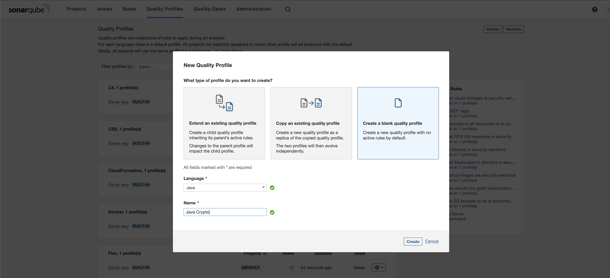
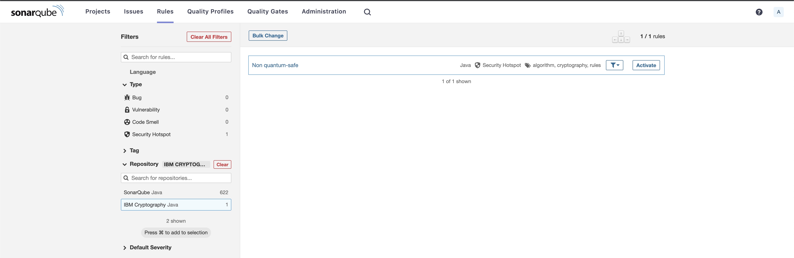
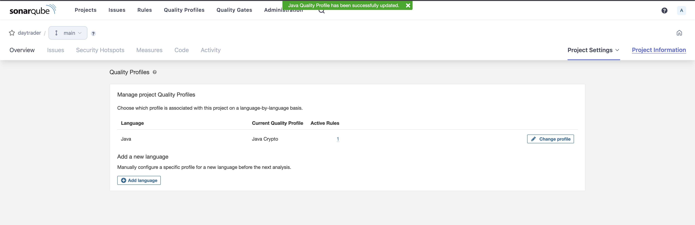

# Sonar Cryptography Plugin

 <!--- long-description-skip-begin -->

This repository contains a SonarQube Plugin that detects cryptographic assets 
in source code and generates [CBOM](https://cyclonedx.org/capabilities/cbom/).

## Version compatibility

| Plugin Version | SonarQube Version    |
|----------------|----------------------|
| 1.x.x and up   | SonarQube 9.8 and up |

## Supported languages and libraries

| Language | Cryptographic Library                                                                         | Coverage | 
|----------|-----------------------------------------------------------------------------------------------|----------|
| Java     | [JCA](https://docs.oracle.com/javase/8/docs/technotes/guides/security/crypto/CryptoSpec.html) | 100%     |
|          | [BouncyCastle](https://github.com/bcgit/bc-java) (*light-weight API*)                         | 100%[^1] |
| Python   | [pyca/cryptography](https://cryptography.io/en/latest/)                                       | 100%     |

[^1]: We only cover the BouncyCastle *light-weight API* according to [this specification](https://javadoc.io/static/org.bouncycastle/bctls-jdk14/1.75/specifications.html)

> [!NOTE]
> The plugin is designed in a modular way so that it can be extended to support additional languages and recognition rules to support more libraries.
> - To add support for another language or cryptography library, see [*Extending the Sonar Cryptography Plugin to add support for another language or cryptography library*](./docs/LANGUAGE_SUPPORT.md)
> - If you just want to know more about the syntax for writing new detection rules, see [*Writing new detection rules for the Sonar Cryptography Plugin*](./docs/DETECTION_RULE_STRUCTURE.md)

## Installation

Copy the plugin (one of the JAR files from the [latest releases](https://github.com/IBM/sonar-cryptography/releases), 
depending on whether you are using JRE 17 or later or JRE 11) to `$SONARQUBE_HOME/extensions/plugins` and restart 
SonarQube ([more](https://docs.sonarqube.org/latest/setup-and-upgrade/install-a-plugin/)).

> [!NOTE]
> We are currently in the process of adding the plugin to the SonarQube marketplace. You will then be able to install
> the plugin directly via the marketplace and no longer have to add it manually to the plugin directory.

## Using

The plugin provides new inventory rules (IBM Cryptography Repository) regarding the use of cryptography for 
the supported languages.
If you enable these rules, a source code scan creates a cryptographic inventory by creating a 
[CBOM](https://cyclonedx.org/capabilities/cbom/) with all cryptographic assets and writing 
a `cbom.json` to the scan directory.

### Create a Quality Profile with Cryptographic Rules

The crypto rules added by the plugin are not per default activated. Create a new quality profile for a specific language.

Then (on the top right) open the profile settings and activate more rules. Find the new
rules (IBM Cryptography) and activate them.

Open the project you created before and open *Project Settings* and there *Quality Profile*.
If not already there, add Java or Python as a language and select the extended Quality Profile with the
activated crypto rules.

### Scan Source Code

Now you can follow the [SonarQube documentation](https://docs.sonarqube.org/latest/analyzing-source-code/overview/) 
to start your first scan.

## Contribution Guidelines

If you'd like to contribute to Sonar Cryptography Plugin, please take a look at our
[contribution guidelines](CONTRIBUTING.md). By participating, you are expected to uphold our [code of conduct](CODE_OF_CONDUCT.md).

We use [GitHub issues](https://github.com/IBM/sonar-cryptography/issues) for tracking requests and bugs. For questions
start a discussion using [GitHub Discussions](https://github.com/IBM/sonar-cryptography/discussions).

## License

[Apache License 2.0](LICENSE.txt)

