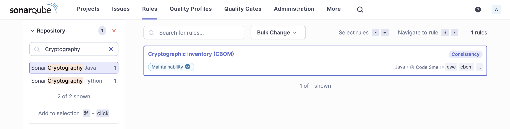

# Sonar Cryptography Plugin (CBOMkit-hyperion)

[](https://opensource.org/licenses/Apache-2.0) <!--- long-description-skip-begin -->
[](https://github.com/cbomkit/sonar-cryptography/releases)


This repository contains a SonarQube Plugin that detects cryptographic assets
in source code and generates [CBOM](https://cyclonedx.org/capabilities/cbom/).
It is part of **the [CBOMKit](https://github.com/cbomkit) toolset**.

## Table of Contents

- [Version compatibility](#version-compatibility)
- [Supported languages and libraries](#supported-languages-and-libraries)
- [Installation](#installation)
- [Using](#using)
- [Example Output](#example-output)
- [Build](#build)
- [Help and troubleshooting](#help-and-troubleshooting)
- [Contribution Guidelines](#contribution-guidelines)
- [License](#license)

## Version compatibility

| Plugin Version | SonarQube Version                       | Requires Java |
| --------------- | ---------------------------------------- | -------------- |
| 2.0.0 and up    | SonarQube 2025.1 (LTA) and up            | 21             |
| 1.3.2 to 1.3.x  | SonarQube 9.14 (LTS) up to 2025.1 (LTA)  | 17             |
| 1.2.0 to 1.3.1  | SonarQube 9.14 (LTS) up to 10.4          | 17             |

## Supported languages and libraries

| Language | Cryptographic Library                                                                                       | Coverage            |
| -------- | ------------------------------------------------------------------------------------------------------------- | ------------------- |
| Java     | [JCA](https://docs.oracle.com/javase/8/docs/technotes/guides/security/crypto/CryptoSpec.html)                 | 100%                |
|          | [BouncyCastle](https://github.com/bcgit/bc-java) (_light-weight API_)                                         | 100%[^1]            |
| Python   | [pyca/cryptography](https://cryptography.io/en/latest/)                                                       | 100%                |
| Go       | [crypto](https://pkg.go.dev/crypto) (_standard library_)                                                      | 100%[^2]            |
|          | [golang.org/x/crypto](https://pkg.go.dev/golang.org/x/crypto)                                                 | Partial[^3]         |
| C#       | [System.Security.Cryptography](https://learn.microsoft.com/en-us/dotnet/api/system.security.cryptography)     | In development[^4]  |
| C/C++    | [OpenSSL](https://www.openssl.org/)                                                                           | 100%[^5]            |

[^1]: We only cover the BouncyCastle _light-weight API_ according to [this specification](https://javadoc.io/static/org.bouncycastle/bctls-jdk14/1.80/specifications.html)

[^2]: All packages under [`crypto`](https://pkg.go.dev/crypto@go1.25.6#section-directories) are covered except `crypto/x509`

[^3]: Covers `golang.org/x/crypto/hkdf`, `golang.org/x/crypto/pbkdf2`, and `golang.org/x/crypto/sha3`
[^4]: C# support uses an [ANTLR v7 grammar](https://github.com/antlr/grammars-v4/tree/master/csharp) to parse source files directly. The current csharp support only covers the language support and does not contain detection rules other than the rules used for verifying the detection engine. **This is not yet meant for active usage!** **Known limitations of the detection engine:** no cross-method variable tracking (only single-method scope), only works for c# v7, string-based matching (no type resolution)

[^5]: Covers OpenSSL EVP API (ciphers, digests, MACs, KDFs, key agreement, key generation, signatures), legacy API, SSL/TLS functions, and PRNG. Requires the [sonar-cxx](https://github.com/SonarOpenCommunity/sonar-cxx) plugin.

> [!NOTE]
> The plugin is designed in a modular way so that it can be extended to support additional languages and recognition rules to support more libraries.
>
> - To add support for another language or cryptography library, see [_Extending the Sonar Cryptography Plugin to add support for another language or cryptography library_](./docs/LANGUAGE_SUPPORT.md)
> - If you just want to know more about the syntax for writing new detection rules, see [_Writing new detection rules for the Sonar Cryptography Plugin_](./docs/DETECTION_RULE_STRUCTURE.md)

## Installation

> [!NOTE]
> To run the plugin, you need a running SonarQube instance with one of the supported
> versions (see [Version compatibility](#version-compatibility) above), and that
> instance's own JVM must be Java 21 or newer — the plugin JAR is built for Java 21
> and a SonarQube server running on Java 17 will fail to load it. If you don't have
> a suitable instance but want to try the plugin, you can use the included Docker
> Compose to set up a development environment. See
> [here](CONTRIBUTING.md#build) for instructions.

Copy the plugin (the JAR file from the [latest releases](https://github.com/cbomkit/sonar-cryptography/releases))
to `$SONARQUBE_HOME/extensions/plugins` and restart
SonarQube ([more](https://docs.sonarqube.org/latest/setup-and-upgrade/install-a-plugin/)).

> [!IMPORTANT]
> C/C++ support is provided by bundling [sonar-cxx](https://github.com/SonarOpenCommunity/sonar-cxx)
> inside this plugin's JAR, the same way Java, Python and Go parsing are bundled. Do not
> also install a standalone sonar-cxx plugin on the same SonarQube instance: both would
> register the same sonar-cxx configuration properties and SonarQube will fail to start.

## Using

The plugin provides new rules regarding the use of cryptography for the supported languages.
They are grouped in the **Sonar Cryptography** rule repositories, one per language
(`sonar-java-crypto`, `sonar-python-crypto` and `sonar-go-crypto`).
If you enable the *Cryptographic Inventory (CBOM)* rule, a source code scan creates a cryptographic
inventory by creating a [CBOM](https://cyclonedx.org/capabilities/cbom/) with all cryptographic
assets and writing a `cbom.json` to the scan directory.

### Add Cryptography Rules to your Quality Profile

This plugin incorporates rules specifically focused on cryptography.

> To generate a Cryptography Bill of Materials (CBOM), it is mandatory to activate the
> *Cryptographic Inventory (CBOM)* rule.



The plugin currently ships these rules:

| Rule                                                     | Languages        | Contributes to the CBOM |
|----------------------------------------------------------|------------------|-------------------------|
| *Cryptographic Inventory (CBOM)*                         | Java, Python, Go | yes                     |
| *Do not use MD5 for cryptographic purposes like hashing* | Java, Python     | no                      |

Only the *Cryptographic Inventory (CBOM)* rule writes a `cbom.json`; the other rules just raise
issues on the scanned code. Future updates may introduce additional rules to expand functionality.

### Scan Source Code

Now you can follow the [SonarQube documentation](https://docs.sonarqube.org/latest/analyzing-source-code/overview/)
to start your first scan.

### Configuration

| Property                   | Default | Scope   | Description                                                                   |
|----------------------------|---------|---------|-------------------------------------------------------------------------------|
| `sonar.cryptoScanner.cbom` | `cbom`  | Project | Filename (without extension) of the generated CBOM, written as `<name>.json`. |

The property can be set in the SonarQube UI under *Project Settings → General*, or passed to the
scanner directly:

```bash
sonar-scanner -Dsonar.cryptoScanner.cbom=my-cbom
```

### Visualizing your CBOM

Once you have scanned your source code with the plugin, and obtained a `cbom.json` file, you can use [CBOMkit](https://github.com/cbomkit/cbomkit) service to know more about it.
It provides you with general insights about the cryptography used in your source code and its compliance with post-quantum safety.
It also allows you to explore precisely each cryptography asset and its detailed specification, and displays where it appears in your code.

## Example Output

The plugin generates a `cbom.json` file in [CycloneDX CBOM format](https://cyclonedx.org/capabilities/cbom/). Here's an example showing detected cryptographic assets:

```json
{
  "bomFormat": "CycloneDX",
  "specVersion": "1.6",
  "version": 1,
  "metadata": {
    "timestamp": "2026-01-20T10:58:39Z",
    "tools": {
      "services": [
        {
          "name": "CBOMkit",
          "provider": { "name": "PQCA" }
        }
      ]
    }
  },
  "components": [
    {
      "name": "SHA256",
      "type": "cryptographic-asset",
      "bom-ref": "0f4f522b-ef99-43b7-9f98-6e83b3b233ca",
      "evidence": {
        "occurrences": [
          {
            "line": 51,
            "location": "src/main/java/com/example/EncryptionConfig.java",
            "additionalContext": "java.security.MessageDigest#getInstance"
          }
        ]
      },
      "cryptoProperties": {
        "oid": "2.16.840.1.101.3.4.2.1",
        "assetType": "algorithm",
        "algorithmProperties": {
          "primitive": "hash",
          "cryptoFunctions": ["digest"],
          "parameterSetIdentifier": "256"
        }
      }
    },
    {
      "name": "AES128-GCM",
      "type": "cryptographic-asset",
      "bom-ref": "e006c3f1-912a-4de5-8399-79bf0f350cb9",
      "evidence": {
        "occurrences": [
          {
            "line": 29,
            "location": "src/main/java/com/example/aes/AESGCM.java",
            "additionalContext": "javax.crypto.Cipher#getInstance"
          }
        ]
      },
      "cryptoProperties": {
        "oid": "2.16.840.1.101.3.4.1",
        "assetType": "algorithm",
        "algorithmProperties": {
          "mode": "gcm",
          "primitive": "ae",
          "cryptoFunctions": ["decrypt"],
          "parameterSetIdentifier": "128"
        }
      }
    },
    {
      "name": "RSA-OAEP",
      "type": "cryptographic-asset",
      "bom-ref": "ff238e09-dd3d-44c4-ad49-34350f1d9cc7",
      "cryptoProperties": {
        "oid": "1.2.840.113549.1.1.7",
        "assetType": "algorithm",
        "algorithmProperties": {
          "mode": "ecb",
          "padding": "oaep",
          "primitive": "pke",
          "parameterSetIdentifier": "2048"
        }
      }
    }
  ],
  "dependencies": [
    {
      "ref": "secret-key-ref",
      "dependsOn": ["AES128-ref"]
    }
  ]
}
```

The CBOM includes:
- **Algorithms**: Hash functions, ciphers, key exchange mechanisms with their parameters
- **Keys and secrets**: Private keys, secret keys, and other cryptographic materials
- **Evidence**: Source file locations where each asset was detected
- **Dependencies**: Relationships between cryptographic assets (e.g., a secret key depending on an algorithm)

## Build

```bash
# Build with tests
mvn clean package

# Build without tests (faster)
mvn clean package -DskipTests

# Build specific module
mvn clean package -pl java

# Format code (Google Java Format, AOSP style)
mvn spotless:apply

# Check formatting
mvn spotless:check
```

<details>
<summary><strong>Adding packages to sonar-go-to-slang (Go support)</strong></summary>

Go cryptographic detection relies on [sonar-go-to-slang](https://github.com/SonarSource/sonar-go/tree/master/sonar-go-to-slang) for type resolution. The default binary includes common packages, but some cryptographic packages may require you to rebuild it with additional package export data.

### When is this needed?

If you see "undefined: \<identifier\>" errors during type checking for packages like `crypto/hmac`, `crypto/elliptic`, or `crypto/ecdsa`, you need to add the missing package export data.

### Steps to add a package

1. **Generate the package export data file** (`.o` file):

```go
//go:build ignore

package main

import (
    "fmt"
    "go/importer"
    "go/token"
    "os"
    "golang.org/x/tools/go/gcexportdata"
)

func main() {
    fset := token.NewFileSet()
    imp := importer.ForCompiler(fset, "gc", nil)
    pkg, err := imp.Import("crypto/hmac")  // <-- target package
    if err != nil {
        fmt.Fprintf(os.Stderr, "Error importing package: %v\n", err)
        os.Exit(1)
    }
    file, err := os.Create("packages/crypto_hmac.o")  // <-- output file
    if err != nil {
        fmt.Fprintf(os.Stderr, "Error creating file: %v\n", err)
        os.Exit(1)
    }
    defer file.Close()
    // CRITICAL: Pass nil for fset, NOT the fset used for import
    if err := gcexportdata.Write(file, nil, pkg); err != nil {
        fmt.Fprintf(os.Stderr, "Error writing export data: %v\n", err)
        os.Exit(1)
    }
    fmt.Printf("Successfully created package export data for %s\n", pkg.Path())
}
```

Run with `go run gen_package.go`, then delete the script.

> **CRITICAL**: The `gcexportdata.Write` call must pass `nil` for the `fset` parameter. Passing the same fset used for import will embed absolute file paths, causing runtime errors.

2. **Check for dependencies**: Some packages depend on types from other packages. Common dependencies:

| Package | May require |
|---------|-------------|
| `crypto/hmac` | `hash` |
| `crypto/cipher` | `io` |
| `crypto/*` (most) | `io`, `hash` |

3. **Add mapping entry** to `mapping_generated.go` in alphabetical order:

```go
"crypto/hmac": "crypto_hmac.o",
```

4. **Rebuild the binary**: `./make.sh build`

### File naming convention

| Package Path | Export Data File |
|--------------|------------------|
| `crypto/hmac` | `crypto_hmac.o` |
| `crypto/elliptic` | `crypto_elliptic.o` |
| `golang.org/x/crypto/bcrypt` | `x_crypto_bcrypt.o` |

</details>

## Help and troubleshooting

If you encounter difficulties or unexpected results while installing the plugin with SonarQube, or when trying to scan a repository, please check out our guide [*Testing your configuration and troubleshooting*](docs/TROUBLESHOOTING.md) to run our plugin with step-by-step instructions.

To measure the plugin's runtime performance and heap usage — including a full end-to-end scan of a large project (Keycloak) — see [*Performance & Heap Testing*](docs/PERFORMANCE_TESTING.md).

## Contribution Guidelines

If you'd like to contribute to Sonar Cryptography Plugin, please take a look at our
[contribution guidelines](CONTRIBUTING.md). By participating, you are expected to uphold our [code of conduct](CODE_OF_CONDUCT.md).

We use [GitHub issues](https://github.com/cbomkit/sonar-cryptography/issues) for tracking requests and bugs. For questions
start a discussion using [GitHub Discussions](https://github.com/cbomkit/sonar-cryptography/discussions).

## License

[Apache License 2.0](LICENSE.txt)
