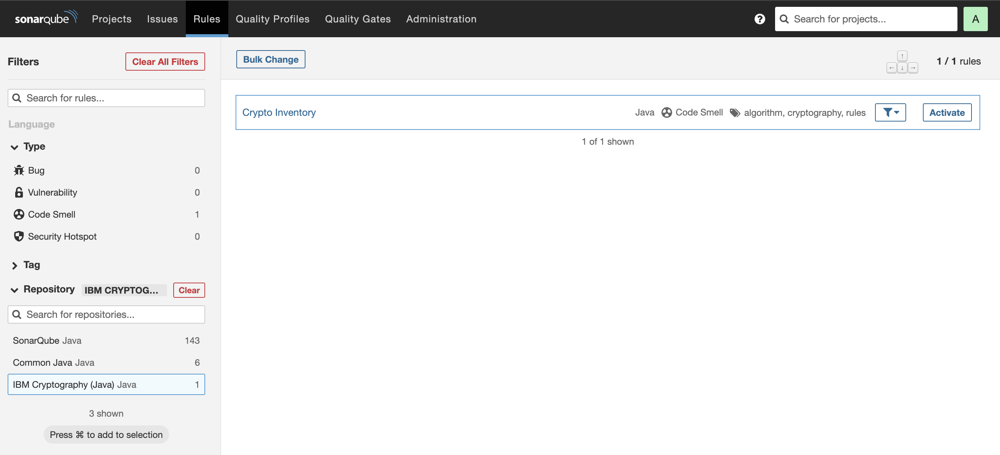

# Sonar Cryptography Plugin

This repository contains a SonarQube Plugin that detects cryptographic assets 
in source code and generates CBOM.

## Plugin version compatibility

| Plugin Version | SonarQube Version    |
| -------------- | -------------------- |
| 1.x.x and up   | SonarQube 9.8 and up |

## Latest supported languages and libraries

| Language | Cryptographic Library | Coverage | 
| -------- | --------------------- | -------- |
| Java     | JCA                   | 100%     |
|          | BouncyCastle          | 80%      |
| Pyrhon   | pycrypto              | 100%     |

> The plugin is designed so that it can be extended to support additional languages and recognition rules to support more libraries. Detailed instructions on how to add new languages and recognition rules will follow shortly.

## Development and Contribution

See [development setup](DEVELOPMENT.md).

## Installation

Copy the plugins (jar files) to $SONAR_INSTALL_DIR/extensions/plugins and restart 
SonarQube ([more](https://docs.sonarqube.org/latest/setup-and-upgrade/install-a-plugin/)).

## Using

Each plugin provides new rules (IBM Cryptography Repository) related to the use of cryptography in Java or Python source code.
By enabling these rules, a source code scan will check the code for these rules and mark a new security 
hotspot in case of violation.
In addition, a source code scan generates a CBOM with all cryptographic results and writes a `cbom.json` to 
the scan directory.

### Create a Quality Profile with Crypto Rules

The crypto rules added by the plugin are not per default activated. Create a new quality profile for Java or Python.

Then (on the top right) open the profile settings and activate more rules. Find the new
rules (IBM Cryptography) and activate them.

Open the project you created before and open *Project Settings* and there *Quality Profile*.
If not already there, add Java or Python as a language and select the extended Quality Profile with the
activated crypto rules.

### Scan Source Code

Now you can follow the [SonarQube documentation](https://docs.sonarqube.org/latest/analyzing-source-code/overview/) 
to start your first scan.

