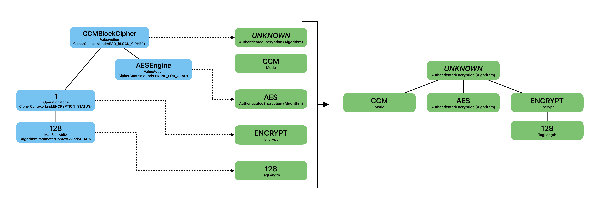
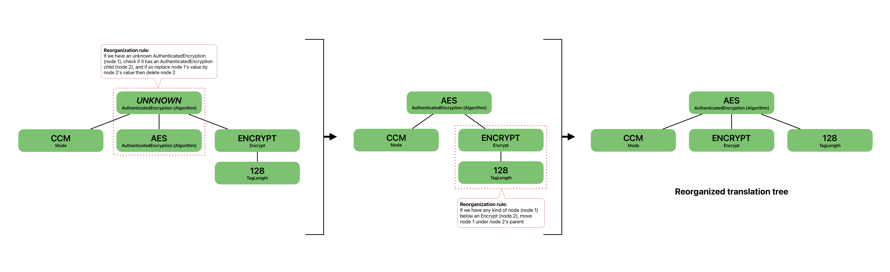

# Writing new detection rules for the Sonar Cryptography Plugin

The Sonar Cryptography Plugin is designed with a modular architecture so that you can easily write new detection rules for cryptography assets.
Here, we explain in detail our powerful high-level syntax that you can use to define a detection rule in a few lines, independently of the programming language of the source code.
We then guide you to translate the findings of these rules into a standard representation in the domain of cryptography, which is used to create a CBOM.

> [!IMPORTANT]
> If the programming language that you want to scan is not yet supported by our plugin, or if you want to add support for a cryptography library from scratch, please read [*Extending the Sonar Cryptography Plugin to add support for another language or cryptography library*](./LANGUAGE_SUPPORT.md) in parallel.

## Writing a detection rule

For a relatively easy and short syntax, we follow the [builder design pattern](https://refactoring.guru/design-patterns/builder) to let you construct detection rules step by step.
The interface specifying precisely this builder pattern (the allowed ordering of the construction steps) is [`IDetectionRule`](../engine/src/main/java/com/ibm/engine/rule/IDetectionRule.java).

The entry-point of a detection rule is a function call (or similarly a class instantiation).
A cryptography library will indeed provide you with various functions you can call to perform a cryptographic operation.
The information about the involved cryptography assets can be part of the function name (a function called `aesEncrypt()`), of the function arguments (a function `encrypt(String algorithmName)`) or of the object on which the function is called (an `encrypt()` function called on a `crypto.AES` object).
Sometimes, it is a mix of everything.
But in each case, there is an expression for the relevant language that we want to detect in order to extract the necessary cryptographic information.

### Specification

Because visualizing the builder pattern from the [`IDetectionRule`](../engine/src/main/java/com/ibm/engine/rule/IDetectionRule.java) interface is not trivial, we provide below a *regex-like* specification indicating how you can order the construction steps to detect a function call.
It contains these three *regex-like* syntax elements:
- `[ ... ]?`: an optional builder statement
- `[ ... ]+`: one or more repetitions of the enclosed statement
- `A | B` indicates that exactly one of A or B must be chosen

```java
new DetectionRuleBuilder<T>()
     .createDetectionRule()
     .forObjectTypes(types) | .forObjectExactTypes(types)
     .forMethods(names) | .forConstructor()
     [.shouldBeDetectedAs(actionFactory)]?
     [
         .withMethodParameter(type) | .withMethodParameterMatchExactType(type)
         [
             .shouldBeDetectedAs(valueFactory)
             [.asChildOfParameterWithId(id)]?
         ]?
         [.addDependingDetectionRules(detectionRules)]?
     ]+
     .buildForContext(detectionValueContext)
     .inBundle(bundle)
     .withDependingDetectionRules(detectionRules) | .withoutDependingDetectionRules()
```

You may have noticed that this specification does not allow constructing rules for function calls with no parameters.
Indeed, to keep the specification above simpler, we handle this case separately [later](#special-cases-no-parameters-and-any-parameters).

### Detailed explanations

Writing a detection rule starts with instantiating a new [`DetectionRuleBuilder`](../engine/src/main/java/com/ibm/engine/rule/builder/DetectionRuleBuilder.java) and calling its `createDetectionRule()` method.
Notice that `DetectionRuleBuilder<T>` is a generic class, that should be parametrized with a language-specific type (learn more [here](./LANGUAGE_SUPPORT.md#identifying-the-four-classes-to-use-in-generics)).
Then, the two next builder steps aim at identifying the function call that you want to capture, by specifying first its type and then its name.

To specify its type(s), you can use `forObjectTypes(String... types)` to capture any function call that is called on an object whose type is matching one of the provided types **or subtypes**. Instead, you can also use `.forObjectExactTypes(String... types)` to only capture function calls matching one of the provided exact types (and not their subtypes).

> [!NOTE]
> Some languages, like Python, can have functions defined directly in a file and not in a class, in this case the function is not "called on an object". In this case, the meaning of the provided types depends on the implementation of the language support for the Sonar Cryptography Plugin: you should look into the documentation or code describing what this "object type" represents in your language. In particular, you can look into the implementation of the function `getInvokedObjectTypeString` in the [`ILanguageTranslation`](../engine/src/main/java/com/ibm/engine/language/ILanguageTranslation.java) implementation of your language. For example in Python, we define this type as the "fully qualified name" of the function, which is its full import path.

You then have to specify the name(s) of the function(s) you want to capture using `forMethods(String... names)`.
Alternatively, you can use `forConstructor()` to capture constructors of the object specified previously (note that constructors are internally defined as `<init>` functions, since this is the representation used by the sonar language parsers).

Then, you can add an optional `shouldBeDetectedAs(IActionFactory<T> actionFactory)` step.
This allows you to capture some information related to your function (and not its parameters).
The information that you capture must be a [`IActionFactory`](../engine/src/main/java/com/ibm/engine/model/factory/IActionFactory.java), so typically an action like "encrypt" or "hash". Several classes already implement `IActionFactory` and offer to choose among common actions.
Alternatively, [`ValueActionFactory`](../engine/src/main/java/com/ibm/engine/model/factory/ValueActionFactory.java) allows you to capture any string value that you provide.
For example, for a function call `initAes()` or `AES.init()`, here is the place to capture the use of the AES algorithm, using `shouldBeDetectedAs(new ValueActionFactory<>("AES")`.

> [!IMPORTANT]
> When defining detection rules, `shouldBeDetectedAs` is the only statement which specify the "capture" of information. It can be done at the top level of a detection rule (like we just explained), or at the level of a function parameter (explained later below). 

At this point, to identify the exact function call that we want to detect, we have to specify all the parameters of the function call.
We therefore add `withMethodParameter(String type)` for each parameter, with its type.
Similarly to previously, we can use `withMethodParameterMatchExactType(String type)` instead, if we want to capture function calls where the parameter matches with the exact type (and not a subtype).

Then, below each specified method parameter, we can optionally capture the value of this parameter using `shouldBeDetectedAs(IValueFactory<T> valueFactory)`.
This is similar to the `shouldBeDetectedAs(IActionFactory<T> actionFactory)` step, but we now capture parameter information in the form of a [`IValueFactory`](../engine/src/main/java/com/ibm/engine/model/factory/IValueFactory.java).
We offer multiple classes implementing `IValueFactory` allowing you to capture various information. Here are two common examples:
- The parameter contains a string specifying the chosen algorithm (like in the function call `encrypt("AES")`): `shouldBeDetectedAs(new AlgorithmFactory<>())` will capture the string `AES`.
- The parameter contains an integer specifying the bit size of the key (like in the function call `createNewKeyWithSize(256)`): `shouldBeDetectedAs(new KeySizeFactory<>(Size.UnitType.BIT))` will capture the integer `256`.

This step may optionally be followed by a `asChildOfParameterWithId(int id)` statement, which provides finer-grained control for structuring the tree-shape of detected values.
Indeed, by default, all values detected with `shouldBeDetectedAs` in a same rule are set at the same level in the tree of detections (no matter if it's a top level or a parameter detection).
The step `asChildOfParameterWithId` allows you to put the associated detected value below (in the tree) the detection identified by `id`.
The `id` of a detected value is `-1` if it comes from the top level detection, or the index (starting at `0`) of the parameter detection of the rule.
> TODO: is it the index of the parameter, or the index of the `shouldBeDetectedAs` of parameters?

After this optional capture phase, there is another optional step to add dependent detection rules to the parameter, using `addDependingDetectionRules(List<IDetectionRule<T>> detectionRules)`.
This step will apply the provided detection rules on the associated function parameter, which may result in additional captured values.
This can be very useful when your function parameter is a value deriving from another function call which uses another parameter that you want to capture.
In the tree of detected values, the values detected by these dependent detection rules are placed under the detections of the parent detection rules.
> TODO: What happens when the parent detection rule has several detections? Under which one goes the dependent rule detections? Fix the current bug.

At this point, you should have repeated all the steps starting from the `withMethodParameter` to here as many times as there are parameters in the function that you want to capture.

Then, `buildForContext(IDetectionContext detectionValueContext)` defines the detection context ([`IDetectionContext`](../engine/src/main/java/com/ibm/engine/model/context/IDetectionContext.java)) for all the detected values of your rule (but detections from dependent rules have their own context).
A detection context is therefore linked to each detected value, and is designed to categorize your findings and to help you carry additional information that is not present in the detected value.
For example, let's say you want to capture the instantiation `new PKCS7Padding()`. You can write your detection rule with a top level detection `shouldBeDetectedAs(new ValueActionFactory<>("PKCS7"))`. In order to specify that `PKCS7` is a padding, you can use the detection context, by using `buildForContext(new CipherContext(CipherContext.Kind.PADDING))`. This context first coarsely categorizes your finding as related to ciphers, and specifies more precisely that it is a padding.

After, we have `inBundle(IBundle bundle)` that requires us to link our rule to a bundle identifier ([`IBundle`](../engine/src/main/java/com/ibm/engine/rule/IBundle.java)).
Indeed, we may have several functions or constructors doing the same thing, typically all having the same name, but differing by the various parameters they have.
In this case, we have to write one detection rule per function.
But using the same bundle identifier for all these rules, we can specify that these rules all belong together.

And finally, we can finish the specification of the detection rules by adding top level dependent detection rules with `withDependingDetectionRules(List<IDetectionRule<T>> detectionRules)` (or not, using `withoutDependingDetectionRules()` instead).
These are similar to the parameter dependent rules, but instead of applying these rules on a parameter, they are applied to the object itself, i.e. to the object with which the rule matched in the first place. 

> [!TIP]
> You will find all the classes implementing the action factories, value factories and contexts (that you may use in the functions described above) in the [`model`](../engine/src/main/java/com/ibm/engine/model/) directory of the engine.

### Example

To showcase what we just explained, here is an example of Java source code.
Let's say that we want to capture all the cryptography information related to the `CFBBlockCipher`: the CFB mode, the AES base cipher, the block size of 256, and additional information linked to the `cfb.init(...)` function call.

```java
public void AESCipherCFBmode(byte[] key) {
    BlockCipher aes = AESEngine.newInstance();
    CFBBlockCipher cfb = CFBBlockCipher.newInstance(aes, 256);
    KeyParameter kp = new KeyParameter(key);
    cfb.init(false, kp);
    return;
}
```

We therefore write the rule below:
```java
new DetectionRuleBuilder<Tree>()
    .createDetectionRule()
    .forObjectTypes("org.bouncycastle.crypto.modes.CFBBlockCipher")
    .forMethods("newInstance")
    .shouldBeDetectedAs(new ValueActionFactory<>("CFB"))
    .withMethodParameter("org.bouncycastle.crypto.BlockCipher")
        .addDependingDetectionRules(BcBlockCipherEngine.rules())
    .withMethodParameter("int")
        .shouldBeDetectedAs(new BlockSizeFactory<>(Size.UnitType.BIT))
        .asChildOfParameterWithId(-1)
    .buildForContext(new CipherContext(CipherContext.Kind.MODE))
    .inBundle(() -> "BcBlockCipher")
    .withDependingDetectionRules(BcBlockCipherInit.rules());
```

We first specify the exact function call that we want to capture, which is here the `newInstance` function called on the `org.bouncycastle.crypto.modes.CFBBlockCipher` object, with two parameters (of type `org.bouncycastle.crypto.BlockCipher` and `int`).

The mode "CFB" is captured using a top level detection `shouldBeDetectedAs(new ValueActionFactory<>("CFB"))`. To know that this is a mode, we use the appropriate detection context `new CipherContext(CipherContext.Kind.MODE)`.
We also capture directly the second parameter of the function rule; the block size "256" (it will be attributed the same context, but we can distinguish it from a mode as it will be captured as a `BlockSize` object).
This parameter detection is placed below the mode detection using `asChildOfParameterWithId(-1)`.

To capture the first parameter, we rely instead on a list of dependent detection rules `BcBlockCipherEngine.rules()`, that should capture all the possible `BlockCipher` classes existing in the library. In our case, a dependent rule targeting `AESEngine.newInstance()` should capture the value "AES", with a context that should specify that it is the base cipher.

Finally, a list of top level dependent detection rules `BcBlockCipherInit.rules()` should capture some information contained in the `cfb.init(...)` function call.


### Special cases: no parameter and any parameters

Recall that we have not discussed the case where we want to detect a function call without parameters.
We provide below another *regex-like* specification indicating how you can order the construction steps for two special cases.

```java
new DetectionRuleBuilder<T>()
    .createDetectionRule()
    .forObjectTypes(types) | .forObjectExactTypes(types)
    .forMethods(names) | .forConstructor()
    .shouldBeDetectedAs(actionFactory)
    .withoutParameters() | withAnyParameters()
    .buildForContext(detectionValueContext)
    .inBundle(bundle)
    .withDependingDetectionRules(detectionRules) | .withoutDependingDetectionRules()
```

Where you would previously use `withMethodParameter`, you can instead use `withoutParameters()` to indicate that you want to capture a method that does not have parameters.
You can also use `withAnyParameters()` at the same place, this time to indicate that you want to capture any function that satisfy the object type and method name conditions, no matter its parameters.

With these two special steps, you cannot capture any information related to the parameters.
This is why these steps are available **only** when you specify a top level detection (using `shouldBeDetectedAs(IActionFactory<T> actionFactory)`).

## Translating findings of a detection rule

Once you have written your detection rule, and once this rule detects findings when scanning some source code, you will obtain a tree of captured values.
The aim of the translation is to represent these values in a standardized, language-independent tree in the cryptographic domain.
For this, you should represent your cryptographic assets and values using the standard classes defined in the [`model`](../mapper/src/main/java/com/ibm/mapper/model/) directory of the *mapper* module (and not of the engine module like before).

You should use the information contained in the detection context and the type of detection value to decide which type of translation you want to apply.

With the help of some knowledge about cryptography, you can translate those findings into the correct model classes.
It is straightforward to translate what you detected as an *Algorithm* (from `engine`) into an *Algorithm* (from `mapper`).
But if you know that this algorithm is used for public key encryption in the specific context in which you detect it, you may keep this information by using the context `PublicKeyContext` in your detection rule, and then decide to translate it into a `PublicKeyEncryption` (which is a superclass of mapper's `Algorithm`).

As a rule a thumb, there is almost always a straightforward translation of the assets you detect.
But if you keep sufficiently enough information using the context and if you use some cryptography knowledge, you may translate your finding into a more specific class which will then bring more information into the CBOM.

The translation of the tree of detected findings is done node-by-node.
A tree of translated values is built while you are translating your detected values.
During the translation phase, the tree keeps its overall shape
This means that the translation of a child node of a detected value will be appended to the translation of this detected value.

|  | 
|:--:| 
| *This diagram represents the node-by-node translation process. In blue, we have the tree of detected values. The dotted lines show that each detected value gets independently translated into some translated value(s), in green. At the end of the node-by-node translation process, we have a tree of translated values (right part of the diagram) which is composed of each translated value, linked with the same ordering as the tree of detected values. This current result is not satisfying, and we will explain next how we can reorganize this tree of translated values.* |

## Reorganizing the translation tree

The main limitation of this node-per-node translation approach is that we do not have much control over the order of the tree structure of the detected values (which is determined by the structure of your cryptographic library) and consequently not over the tree structure of the translated values.
This is why, in some cases, we introduce another step after the translation, to reorganize the tree of translated values to correctly represent its content.
Note that this reorganization step is not strictly necessary: for example, in the JCA cryptography library in Java, the translated trees immediately have the correct shape (because of how the library is structured).
But this is for example not the case for Java's BouncyCastle library.

### Specification 

We therefore introduce a way to specify *reorganization rules*, using a builder pattern specified with the [`IReorganizerRule`](../mapper/src/main/java/com/ibm/mapper/reorganizer/IReorganizerRule.java) interface.
Like for detection rules, we provide below a *regex-like* specification indicating how you can order the construction steps to reorganize a translation tree.
It contains these (same) two *regex-like* syntax elements:
- `[ ... ]?` represents an optional builder statement
- `A | B` indicates that exactly one of A or B must be chosen

```java
new ReorganizerRuleBuilder()
    .createReorganizerRule()
    .forNodeKind(kind)
    [.forNodeValue(value)]
    [.includingChildren(children) | .withAnyNonNullChildren()]
    [.withDetectionCondition(detectionConditionFunction)]
    .perform(performFunction) | .noAction()
```

### Detailed explanations

Writing a reorganization rule starts with instantiating a new [`ReorganizerRuleBuilder`](../mapper/src/main/java/com/ibm/mapper/reorganizer/builder/ReorganizerRuleBuilder.java) and calling its `createReorganizerRule()` method.

Given a translation tree, the first goal is to check if this tree should be reorganized by this rule.
The rule therefore defines a pattern which will be checked against the tree: if there is a match between this tree and the reorganization rule, then the reorganization will be applied.
This pattern starts by specifying the kind (= type) of a node that should be in the translation tree using `forNodeKind(Class<? extends INode> kind)`.
Then, a specific node value can optionally be specified using `forNodeValue(String value)`.

This creates a pattern over a single node, but the pattern can be a subtree, by optionally defining what the children of this node should be like.
Using `includingChildren(List<IReorganizerRule> children)`, you can include other reorganizer specifications that have to be satisfied by some children of the current node. Note that you can recursively create children rules, meaning that you can specify a tree pattern of an arbitrary size.
Alternatively, you can use `withAnyNonNullChildren()` to simply guarantee that your node has at least one node child.

A last optional step specifying the pattern is to require any other condition, using `withDetectionCondition(Function3<INode, INode, List<INode>, Boolean> detectionConditionFunction)`, where `Function3` is defined as:
```java
@FunctionalInterface
public interface Function3<A1, A2, A3, R> {
    R apply(A1 one, A2 two, A3 three);
}
```
The parameter of `withDetectionCondition` is a function `(node, parent, roots) -> {return ...}` taking the current node, its parent and the root nodes of the translation tree, and returning a boolean specifying whether the pattern is satisfied.
This step can be used to define more specific tree patterns than simply relying on a fixed pattern based on the nodes kinds, values and children.

Finally, while all the previous steps were specifying the tree pattern, we have to define the reorganization action that is performed in case of a pattern match, using `perform(Function3<INode, INode, List<INode>, List<INode>> performFunction)`.
It is also a function `(node, parent, roots) -> {return ...}` taking the current node, its parent and the root nodes of the translation tree, but returning an updated list of root nodes representing the translation tree with the reorganization applied.
Alternatively, it is also possible to use `noAction()` to not define a reorganization action. This is typically the case when defining children reorganization rules in `includingChildren(List<IReorganizerRule> children)`, that are just used to define a pattern.

### Example

Let's suppose that we obtained the following translation tree. These are the correctly translated values, but the message digest should be part of the OAEP. This is therefore a reorganization problem.
```
(BlockCipher) RSA
   └─ (OptimalAsymmetricEncryptionPadding) OAEP
   └─ (MessageDigest) SHA-3
```
This is the target translation that we want to obtain after reorganization:
```
(BlockCipher) RSA
   └─ (OptimalAsymmetricEncryptionPadding) OAEP
      └─ (MessageDigest) SHA-3
```

To do so, we define the following reorganization rule:
```java
new ReorganizerRuleBuilder()
    .createReorganizerRule()
    .forNodeKind(BlockCipher.class)
    .includingChildren(
        List.of(
            new ReorganizerRuleBuilder()
                .createReorganizerRule()
                .forNodeKind(OptimalAsymmetricEncryptionPadding.class)
                .noAction(),
            new ReorganizerRuleBuilder()
                .createReorganizerRule()
                .forNodeKind(MessageDigest.class)
                .noAction()))
    .perform(
        (node, parent, roots) -> {
            INode oaepChild =
                node.getChildren()
                    .get(OptimalAsymmetricEncryptionPadding.class);
            INode messageDigestChild =
                node.getChildren().get(MessageDigest.class).deepCopy();

            // Add the message digest under the OAEP node
            oaepChild.append(messageDigestChild);
            // Remove the message digest from the BlockCipher's children
            node.removeChildOfType(MessageDigest.class);

            return roots;
        });
```

In this rule, we first specify our simple pattern: a `BlockCipher` node with `OptimalAsymmetricEncryptionPadding` and `MessageDigest` children.
When this pattern is detected, the perform function simply appends the `MessageDigest` to the `OptimalAsymmetricEncryptionPadding`, and removes the `MessageDigest` from the children of the `BlockCipher`.

### Having multiple reorganization rules

When you define multiple reorganization rules for your language, you may introduce reorganization conflicts leading to unexpected results or infinite loops.
It is therefore crucial that you understand how these reorganization rules are applied to prevent undesirable consequences.

Reorganization rules are applied according to the logic described in the [`Reorganizer`](../mapper/src/main/java/com/ibm/mapper/reorganizer/Reorganizer.java) class of the `mapper` module.
We iterate on the nodes of the translation tree with a [breadth-first search](https://en.wikipedia.org/wiki/Breadth-first_search) (BFS), and we check for each node if it matches with a reorganization rule.
If it matches, we stop the BFS, and we apply the reorganization and return the updated translation tree (described by its list of root nodes).
We then continue by starting a new BFS on the updated translation tree, starting from the new roots.
This process ends once no reorganization rule matches with the current translation tree in a BFS iteration.

Ideally, you should write your reorganization rules so that the order in which they are applied does not matter.
But if you truly need to assume a fixed ordering, know that the reorganization rules are applied in the list order that you define in the class listing them all ([`JavaReorganizerRules`](../java/src/main/java/com/ibm/plugin/translation/reorganizer/JavaReorganizerRules.java) in Java).

|  | 
|:--:| 
| *This diagram follows the previous one, and starts with the translation tree we obtained before. It shows how we can apply two reorganization rules to this tree to obtain a final translation tree whose structure follows our expectations. In this example, the two reorganization rules are applied in an arbitrary order: notice that we would obtain the same final translation tree if we would apply the two reorganization rules in the opposite order.* |