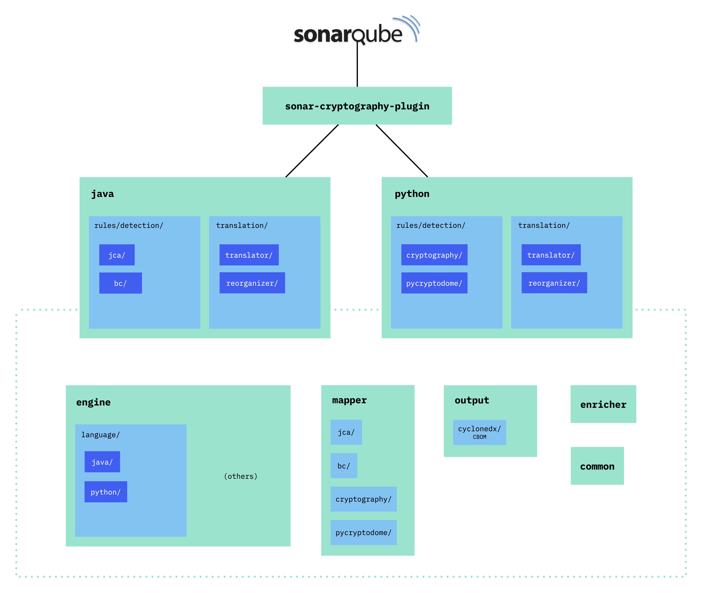
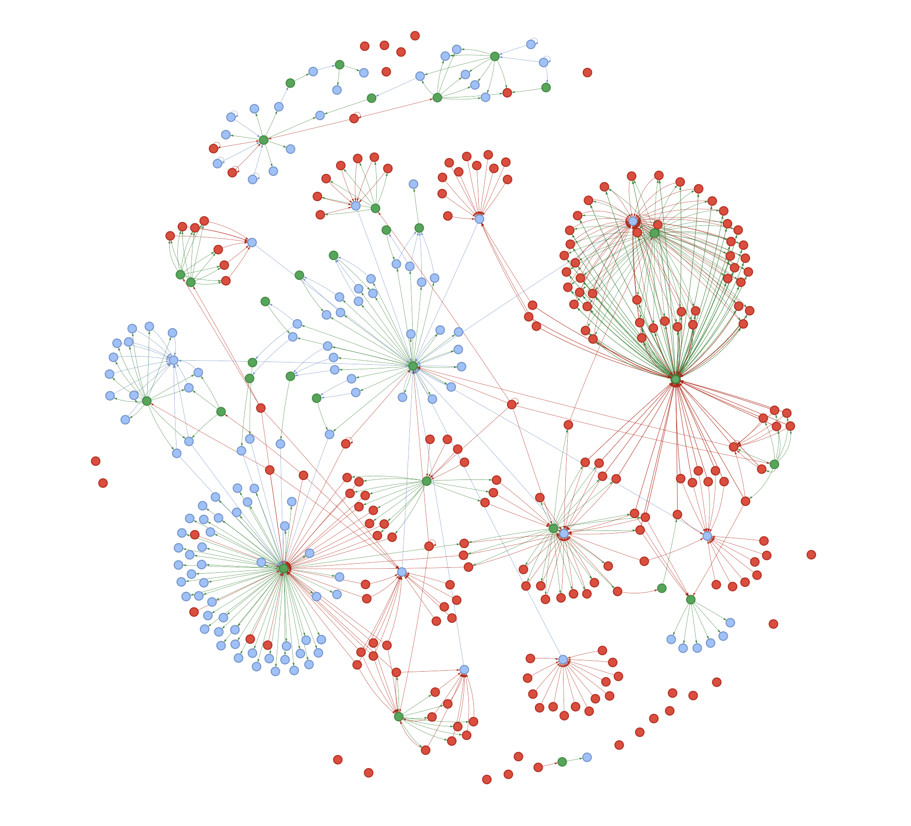

# Extending the Sonar Cryptography Plugin to add support for another language or cryptography library

The Sonar Cryptography Plugin is designed with a modular architecture so that it can be extended to support additional programming languages and cryptography libraries.


## Introduction to the project structure

The Sonar Cryptography Plugin uses a rule-based approach to precisely identify which cryptography assets are used in the scanned code.
Adding support for detecting a cryptography library means writing a set of rules covering all cryptographic assets introduced by the library.

Defining those rules as part of a SonarQube plugin allows us to easily integrate with usual SonarQube workflows, and to benefit from existing support to scan some languages (the languages supported for SonarQube plugins are listed [here](https://docs.sonarsource.com/sonarqube/latest/extension-guide/adding-coding-rules/#custom-rule-support-by-language) in the *Java* column).

### Overview

The project is composed of the following modules:
- The plugin: `sonar-cryptography-plugin`
- One module per supported language, like `java` and `python`
- The detection engine: `engine`
- Four other modules: `mapper`, `enricher`, `output` and `common`


|  | 
|:--:| 
| *High level diagram showing the architecture of the various modules composing the Sonar Cryptography Plugin, shown here with two language extensions (java and python), each language containing two cryptography libaries. The `sonar-cryptography-plugin` module directly depends on the language modules, which themselves depends on a bunch of dependent modules. This diagram shows the extendable parts of the modules: the engine language support, the library-specific mappers, and the choice of output format.* |

### The plugin

The ([`sonar-cryptography-plugin`](../sonar-cryptography-plugin/)) module creates the single SonarQube plugin, for all supported languages, so that we have only one cryptography plugin (and not one per language). 

Its main class is [`CryptoPlugin`](../sonar-cryptography-plugin/src/main/java/com/ibm/plugin/CryptoPlugin.java) which implements the Sonar [`Plugin`](https://javadocs.sonarsource.org/10.3.0.1951/org/sonar/api/Plugin.html) interface, and registers all rules for all languages.
This is done through the `addExtensions` method, and the extension classes to add vary depending on the language (they are usually mentioned in the documentation, or at least appear in the example plugins provided by Sonar – in the class implementing `Plugin`).

This module also defines the choice of output format for all the findings (in [`OutputFileJob`](../sonar-cryptography-plugin/src/main/java/com/ibm/plugin/OutputFileJob.java)).
Indeed, while any SonarQube plugin will natively report the detected cryptographic findings to the SonarQube instance, our plugin adds an output layer capable of exporting the results in any other format.
These output formats can be defined in the `output` module (with the [`IOutputFileFactory`](../output/src/main/java/com/ibm/output/IOutputFile.java) interface).
Currently, our plugin exports the findings in the standard [CBOM](https://cyclonedx.org/capabilities/cbom/) format.

Ultimately, the `sonar-cryptography-plugin` is the entry point of our SonarQube plugin, it is a lightweight class that does not contain much logic but instead relies on the following modules.


### The language modules

To write detection rules based on the content of the source code, we use an intermediary representation of the source code that is more easy to navigate than plain text: an [AST](https://en.wikipedia.org/wiki/Abstract_syntax_tree) (abstract syntax tree).
The conversion of source code into AST is done by a language-specific analyzer. We use the parsers published by Sonar for this purpose.

The built AST provides us with the ability to navigate through the source code and to determine, for example, if some term is a function or a variable.
Because each programming language has its own syntax, these ASTs (and associated APIs) are language specific.

Because of this strong language dependency, we use different modules (like `java` and `python`) to separate our rules based on their programming language

#### The detection rules

A language module, like [`java`](../java/), has two main source folders: `rules` and `translation`. Let's first focus on [`rules`](../java/src/main/java/com/ibm/plugin/rules/).

This folder contains all detection rules for the language, organized by cryptography library. For example, the subfolder [`bc`](../java/src/main/java/com/ibm/plugin/rules/detection/bc/) contains all rules related to the BouncyCastle cryptography library, themselves organized based on the structure of this library.

Each rule defines a pattern corresponding to a function call related to cryptography and specifies which values are of interest to be captured (e.g. algorithm name, mode, padding, ...).
In addition, dependencies between rules can be specified to capture more complex cryptographic schemes with multiple functions (understanding the context).

Because all these detection rules follow a similar structure, our goal was to make their writing as easy and short as possible, with a simple and language-agnostic higher level syntax.
Indeed, defining rules directly using the AST APIs would be very verbose, with a lot of duplicated code to perform similar actions, and consequently hard to read.
This higher level syntax is defined by the interface [`IDetectionRule`](../engine/src/main/java/com/ibm/engine/rule/IDetectionRule.java).

> [!TIP]  
> We explain with much more details this higher level syntax for writing detection rules in [*Writing new detection rules for the Sonar Cryptography Plugin*](./DETECTION_RULE_STRUCTURE.md).

Of course, we don't get this nice syntax for free: something has to bridge the gap between the language-specific AST APIs and our language-agnostic syntax.
This is the role of the `engine` module, that will be detailed later.

#### The translation

Writing detection rules allows us to capture all the values linked to a cryptography asset, for example the name of the algorithm and its mode.
Those values are captured in a tree-like structure based on the definition of detection rules and their dependent detection rules that detected them.
The tree does not contain any semantic information about how the cryptographic values relate to each other.

Ultimately, we want a meaningful representation of all cryptography-relevant values: a tree structure in which the relationships between the nodes have a meaning.
Back to our example, we want a tree where the mode is a child node of the algorithm node, to indicate that it's the mode of this algorithm.

This process of building a meaningful tree representation of the captured cryptography values is called the translation. This process is also part of the language module (like the `java` or `python` module).
The translation process requires at some point to map those captured cryptography strings to a standard representation of the cryptography asset.
For better modularity, this mapping is done as part of the `mapper` module.

The last step of the translation process is called the enrichment, and is done by the `enricher` module.
This step aims at adding content to the translated tree, based on external knowledge.
Indeed, we can get additional information from the documentation of a cryptography library, like some default values.
Maybe our algorithm has a default mode when no mode is specified in the code, in such case we can "enrich" the translated tree with this default mode.
Additionally, we can enrich most cryptography assets with an [object identifier](https://en.wikipedia.org/wiki/Object_identifier) (OID) that uniquely identifies an algorithm and plays an important role in a CBOM.

> [!TIP]  
> The process of translation is also explained with more details in [*Writing new detection rules for the Sonar Cryptography Plugin*](./DETECTION_RULE_STRUCTURE.md).


### The engine

The [`engine`](../engine/) module bridges the gap between the language-specific sonar APIs used for navigating the AST, and the high level language-agnostic API used for writing detection rules.

It has a [`language`](../engine/src/main/java/com/ibm/engine/language/) subfolder that contains the set of functions (defined by five interfaces) to be implemented to set up this high-level API for a language.
More details about these interfaces are given [later](#implementing-the-language-specific-parts-of-the-engine).

The `engine` module contains a lot of other subfolders and files that enable strong detection capabilities, but they are all based on the functions provided by the `language` files and therefore do not need to be modified when adding support for another language.

<br>

## Adding support for another programming language

In this section, we detail step-by-step instructions about how to extend the Sonar Cryptography Plugin to support another language.
Once the plugin supports the targeted language, the [next section](#adding-support-for-another-cryptography-library) will detail how to add support for a cryptography library.

> [!TIP]
> If your language is already supported by our plugin, you can directly skip to [the section](#adding-support-for-another-cryptography-library) explaining in detail how to add support for a cryptography library.

Currently we only support languages that are provided by Sonar, aka for which there is a Sonar parser to generate an abstract syntax tree ([see](https://github.com/search?q=topic%3Alanguage-team+org%3ASonarSource+&type=repositories) the supported language parsers). Theoretically, any language parser (written in Java) that generates an AST from the source code should be integrable, and thus any language for which such a parser exists. With our current implementation, we have only tested the parsers provided by Sonar.


In the following, we will take the example of adding support for the Java language.

### Adding the language parser

The first step is to add a dependency for your sonar language parser to the main `sonar-cryptography` [`pom.xml`](../pom.xml).
You should find a parser for your language by searching the parser provided by Sonar directly ([see](https://github.com/search?q=topic%3Alanguage-team+org%3ASonarSource+&type=repositories)) or by searching for parsers created by the community, such as the one for C/C++ ([see](https://github.com/SonarOpenCommunity/sonar-cxx))

Then, first add its version under `<!-- language parser versions -->`:
```xml
<sonar.java.version>7.35.0.36271</sonar.java.version>
```

And add the dependency (using this version reference) under `<!-- language supporters -->`:
```xml
<dependency>
    <groupId>org.sonarsource.java</groupId>
    <artifactId>sonar-java-plugin</artifactId>
    <version>${sonar.java.version}</version>
</dependency>
```

### Specifying related file extensions

Now, open the [`pom.xml`](../sonar-cryptography-plugin/pom.xml) of the `sonar-cryptography-plugin` module, and look for the tag `<requiredForLanguages>`.
This is where you should specify the file extensions for which you want the plugin to run.
In the case of Java, we want the Cryptography Plugin to run on `.java` and `.jsp` files, so we add these file extensions inside the tag, in addition to already existing ones (like `py` and `ipynb` below). 

```xml
<!-- This line must specify all file extensions which should be scanned by the plugin -->
<requiredForLanguages>java,jsp,py,ipynb</requiredForLanguages>
```

### Identifying the four classes to use in generics

Recall that our methodology aims to bridge the gap between the language-specific parser APIs and a higher level language-agnostic API.
As explained earlier, this part is done in the [engine](#the-engine).
While we will talk [later](#implementing-the-language-specific-parts-of-the-engine) about how to integrate a new language with the engine, we have to highlight that our methodology makes use of [Java generic types](https://docs.oracle.com/javase/tutorial/java/generics/types.html) at multiple places. In particular, our language-"agnostic" high level API still needs to be parametrized by language-dependent types.

We need to find these four types in the language's (Sonar) parser API. It is crucial to take this step early in the development, as not finding these types can compromise the integration of the language with the chosen parser.

>[!NOTE]
> If some of these classes are missing in the APIs of your language, you may create your own custom classes to try to patch this void, by investigating how these classes are used and trying to provide the same functionality. However, this has not been attempted yet and will probably result in significantly more work.

To help you find these classes used to fill the four type parameters `R`, `T`, `S`, `P`, we provide the table below showing what these classes are for the languages we currently support (all of these classes are under the import path `org.sonar.plugins`):

|        | Rule (`R`)               | Tree (`T`)             | Symbol (`S`)                | Publisher (`P`)                   |
|--------|------------------------|----------------------|---------------------------|---------------------------------|
| **Java**   | java.api.**JavaCheck**     | java.api.tree.**Tree**   | java.api.semantic.**Symbol**  | java.api.**JavaFileScannerContext** |
| **Python** | python.api.**PythonCheck** | python.api.tree.**Tree** | python.api.symbols.**Symbol** | python.api.**PythonVisitorContext** |

### Implementing the language-specific parts of the engine

Here are all the interfaces that have to be implemented (specific details about the functions to implement may be documented in the interface files):

- [`IBaseMethodVisitor`](../engine/src/main/java/com/ibm/engine/detection/IBaseMethodVisitor.java) (the class implementing this interface must also extend a language-specific `BaseTreeVisitor` from the sonar API: see [`JavaBaseMethodVisitor`](../engine/src/main/java/com/ibm/engine/language/java/JavaBaseMethodVisitor.java) for example)
- [`IDetectionEngine`](../engine/src/main/java/com/ibm/engine/detection/IDetectionEngine.java)
- [`ILanguageSupport`](../engine/src/main/java/com/ibm/engine/language/ILanguageSupport.java)
- [`ILanguageTranslation`](../engine/src/main/java/com/ibm/engine/language/ILanguageTranslation.java)
- [`IScanContext`](../engine/src/main/java/com/ibm/engine/language/IScanContext.java)

Notice that these interfaces are parametrized by the generics mentioned [previously](#identifying-the-four-classes-to-use-in-generics).

> [!TIP]
> Implementing these classes may be the most challenging part of the process, as it requires to bridge the gap between the language-specific APIs (usually poorly documented) and the engine primitives (that are not documented yet).
> Moreover, there is currently no proper way to test your engine implementation without writing detection rules (which will have to be done later).
>
> We therefore advise the following development process: try your best to implement these interfaces by reading their javadoc, understanding what they are supposed to do and checking how they were implemented for other languages.
> Hopefully, your parser has a relatively similar API as the others, and you can reuse parts of the code.
>
> Because you will not be able to immediately test your implementation, we advise you to start with a "basic" implementation of these interfaces: don't immediately try to handle all edge cases.
> Later, once you will have [created the language module](#creating-a-new-language-module) and be able to write detection rules, you can write test rules and test files to make sure that your engine works as intended (i.e. correctly detects what is specified by the rule).
> If it is not the case, you can then [tune your engine](#tuning-the-engine-if-necessary) implementation until your unit test is fixed.

Once you have implemented these five interfaces, you have to declare your language support to the outside.
To do so, simply add a function in [`LanguageSupporter`](../engine/src/main/java/com/ibm/engine/language/LanguageSupporter.java) that returns an instance of your class implementing `ILanguageSupport`. Here is how it looks for the Java case:

```java
@Nonnull
public static ILanguageSupport<JavaCheck, Tree, Symbol, JavaFileScannerContext>
        javaLanguageSupporter() {
    return new JavaLanguageSupport();
}
```
This function will be used [later](#the-check-registrar-extension-point).

### Creating a new language module

Now that the language analyzer has been registered in the main `pom.xml` and that the engine interfaces have been implemented, we can create a new module named like the language (like [`java`](../java/)).

> [!IMPORTANT]  
> This process depends on how the language analyzer APIs work: **carefully read the available documentation explaining how to create a SonarQube plugin for your language first**. This documentation should take precedence over the more general explanations that we will discuss next.
> 
> The documentation may come with a sample plugin for your language, in this case it will help you to have a look at it to understand how your plugin can integrate with SonarQube.

The first step is to create another [`pom.xml`](../java/pom.xml) for your new module.
Take inspiration from the `pom.xml` of the existing language modules to write it.
In short, it should contain a reference to the parent `sonar-cryptography`, maven properties, dependencies to the other modules that will be used (typically `common`, `output` and `enricher`), and a dependency to the language-specific sonar test kit.

Then, fill your module folder with the same basic structure as the other language modules. For example for java:
```
java
└── src
    ├── main/java/com/ibm/plugin
    │   ├── rules
    │   │   └── detection
    │   └── translation
    └── test
        ├── files/rules
        └── java/com/ibm/plugin/rules
```
<p align="right"><a href="https://tree.nathanfriend.io/?s=(%27opt6s!(%27fancy!true~fullPath3~trailingSlash3~rootDot3)~7(%277%270B5*0src.0main%2F284.*A0detect68translat6.0test8filesC82C5%27)~vers6!%271%27)A%20.5**0-%202B%2Fco9ib9plugin3!false4rules5%5Cn6ion7source!8.*09m%2FA*%20BjavaC%2F4%01CBA987654320.*"><sub><sup>edit this tree<sub><sup></a></p>

`plugin/rules/` will contain the detection rules, organized by cryptography library, and `plugin/translation/` will contain all files related to translation for this language.
The `test/` directory is not important at the beginning, it will be used only once we write detection rules, and we will cover it [later](#adding-support-for-another-cryptography-library).

### Adding the extension points

Then, we have to add *extension points*: these are language-specific interfaces to implement in order to declare the custom detection rules of the module to the plugin. Read the sonar documentation to find what these interfaces are. For Java, these are the interfaces `RulesDefinition` and `CheckRegistrar`, respectively implemented in [`JavaScannerRuleDefinition`](../java/src/main/java/com/ibm/plugin/JavaScannerRuleDefinition.java) and [`JavaCheckRegistrar`](../java/src/main/java/com/ibm/plugin/JavaCheckRegistrar.java) in the `plugin` directory.

> [!IMPORTANT]  
> At this point, we have to clarify an important difference: we distinguish the SonarQube *rules* that we actually add to the plugin, and the detection *rules* (defined [earlier](#the-detection-rules)) that are rules written with our high level syntax and conforming to the `IDetectionRule` interface.
>
> In our plugin architecture, we have chosen to define detection rules independently of the higher-level SonarQube rules that you see in the UI.
> The detection rules are there to collect all possible cryptographic information, while the SonarQube rules can be defined on top of these detections.
> The idea is that a SonarQube rule can be: *Don't use MD5* or *If using RSA, the key size should be larger than 2048*, while the detection rules try to capture all occurrences of these algorithms in the source code.
> At the moment, the plugin only contains an "Inventory" rule that collects all occurrences of cryptographic assets and reports them as a problem to the SonarQube UI.
> This rule extends a language-specific class defined by the API of your Sonar analyzer, such as `IssuableSubscriptionVisitor` in Java or `PythonVisitorCheck` in Python.
> We will later call it the *visitor* class, as it enables to implement functions which are called upon the visitation of a some AST nodes.
>
> This means that on the SonarQube UI, we see only one rule per language, which reports all the cryptography findings. The actual precise information should instead be exported through the `output` module, like we currently do with the CBOM. 

We now explain with a bit more detail what the usual extension points are.

#### The "Check Registrar" extension point

If there is a similar entry point for your language, you can set it up similarly to [`JavaCheckRegistrar`](../java/src/main/java/com/ibm/plugin/JavaCheckRegistrar.java) in Java (or to [`PythonCheckRegistrar`](../python/src/main/java/com/ibm/plugin/PythonCheckRegistrar.java) with the `PythonCustomRuleRepository` interface).

This is the place where the SonarQube rule class should be referenced. Because this rule "regroups" all the detection rules, we call it the *inventory rule*, which is defined in Java as [`JavaInventoryRule`](../java/src/main/java/com/ibm/plugin/rules/JavaInventoryRule.java) in `plugin/rules`[^2].

[^2]: In the Java case, we define an intermediary class [`JavaRuleList`](../java/src/main/java/com/ibm/plugin/JavaRuleList.java) that registers all Java SonarQube rules, which in our case is only [`JavaInventoryRule`](../java/src/main/java/com/ibm/plugin/rules/JavaInventoryRule.java). This allows us to easily refer to all SonarQube rules at other places, like in [`JavaScannerRuleDefinition`](../java/src/main/java/com/ibm/plugin/JavaScannerRuleDefinition.java).

SonarQube rules must extend the language-specific sonar visitor class, `IssuableSubscriptionVisitor` in Java, and must be annotated with a name (we are using "Inventory"):
```java
@Rule(key = "Inventory")
```

We define the logic behind the inventory rule (and in particular how it will relate with all the `IDetectionRule` detection rules) in the `plugin/rules/detection` directory by first creating an intermediary class implementing the language-specific sonar visitor class (`IssuableSubscriptionVisitor` in Java) and from which the inventory rule (`JavaInventoryRule`) will inherit. In Java, we call this class [`JavaBaseDetectionRule`](../java/src/main/java/com/ibm/plugin/rules/detection/JavaBaseDetectionRule.java), and it takes a constructor with a list of `IDetectionRule`[^3].
Implementing this class will require defining a translation process, but we will come to that [later](#bridging-the-gap), and you can keep these parts empty for now.

[^3]: It may also take a list of [`IReorganizerRule`](../mapper/src/main/java/com/ibm/mapper/reorganizer/IReorganizerRule.java) if necessary. More about this in the section [*Reorganizing the translation tree*](./DETECTION_RULE_STRUCTURE.md#reorganizing-the-translation-tree) of *Writing new detection rules for the Sonar Cryptography Plugin*.

This list of `IDetectionRule` is defined in the same directory, in a file listing all the detection rules for this language under a function `rules()`. In Java, we call this file [`JavaDetectionRules`](../java/src/main/java/com/ibm/plugin/rules/detection/JavaDetectionRules.java).
You can currently leave this list of rules empty, and we will discuss [later](#adding-support-for-another-cryptography-library) how to structure these detection rules in the module. 

Back to the intermediary class (`JavaBaseDetectionRule` in Java), this is also the place where we have to check and apply our list of `IDetectionRule`. This can be done by overriding the relevant "visit" method(s) of the visitor class. For example in Java (note that we have not yet defined `JavaAggregator`, which we will do just after):
```java
/**
 * Visits a tree node and applies detection rules to it.
 *
 * @param tree The tree node to visit.
 */
@Override
public void visitNode(@Nonnull Tree tree) {
    detectionRules.forEach(
        rule -> {
            DetectionExecutive<JavaCheck, Tree, Symbol, JavaFileScannerContext>
                detectionExecutive =
                    JavaAggregator.getLanguageSupport()
                        .createDetectionExecutive(
                            tree, rule, new JavaScanContext(this.context));
            detectionExecutive.subscribe(this);
            detectionExecutive.start();
        });
}
```

Here, for each visited node of the AST and for each `IDetectionRule` detection rule, we enable a [`DetectionExecutive`](../engine/src/main/java/com/ibm/engine/executive/DetectionExecutive.java), which is a class from the engine that will take care of applying our detection rules.

Additionally, the intermediary class (`JavaBaseDetectionRule` in Java) should implement the [`IObserver`](../common/src/main/java/com/ibm/common/IObserver.java) interface, consisting of an `update` method. This function will be called each time the scanner detects a finding, and will pass the finding as a parameter.
If we want to export all of our findings in a single output structure, like a CBOM, we need some way to aggregate all results.
This is therefore the purpose of the (empty) interface [`IAggregator`](../output/src/main/java/com/ibm/output/IAggregator.java), implemented in Java by the class [`JavaAggregator`](../java/src/main/java/com/ibm/plugin/JavaAggregator.java) directly in the `plugin` directory.
The aggregator class can maintain a list of findings, that gets extended each time a new finding is detected and reported through the `update` function.
It also implements a `getLanguageSupport()` method that returns the `ILanguageSupport` (using the `LanguageSupporter` defined [earlier](#implementing-the-language-specific-parts-of-the-engine)), which you should use in your "visit" method (like in `visitNode` above).
The `JavaAggregator` implementation is quite generic and can be mostly reused for your implementation, after replacing the generic types by the correct ones, and using the correct language supporter.
> [!TIP]
> By extending the `JavaBaseDetectionRule` class, you can create new high-level SonarQube rules beyond the Inventory rule. The `JavaInventoryRule` is an example of how the underlying cryptographic information (collected by the detection rules) can be utilized. 

#### The "Rule Definition" extension point

If there is a similar entry point for your language, you can set it up similarly to [`JavaScannerRuleDefinition`](../java/src/main/java/com/ibm/plugin/JavaScannerRuleDefinition.java) in Java (or [`PythonScannerRuleDefinition`](../python/src/main/java/com/ibm/plugin/PythonScannerRuleDefinition.java) in Python) by providing basic metadata information about this rule that will be displayed in the SonarQube UI.

The metadata for your (single) SonarQube rule may have to be described with resource files (like `.json` and `.html`).
In this case, similarly to the Java case, you can create a directory for resources (`java/src/main/java/com/ibm/resources/org/sonar/l10n/java/rules/java/` in Java – similarly to what was done in the example Java plugin).
In the Java case, these resource files have to be named with the name of the rule they describe ("Inventory" in our case).


#### Registering the extension points

Now that we have created our extension points, we need to register them at the plugin level.
As explained [previously](#the-plugin), it should be done in the `addExtensions` method of [`CryptoPlugin`](../sonar-cryptography-plugin/src/main/java/com/ibm/plugin/CryptoPlugin.java).
For Java, we add the following lines:
```java
context.addExtensions(
        // java
        JavaScannerRuleDefinition.class,
        JavaCheckRegistrar.class,

        // ...
)
```
Additionally, update the function `getOutputFile` of the [`ScannerManager`](../sonar-cryptography-plugin/src/main/java/com/ibm/plugin/ScannerManager.java) of the plugin module, to add your aggregate of detections to the final list of detections that will be used for generating the CBOM.
For Java, it looks like:
```java
public IOutputFile getOutputFile() {
        List<INode> nodes = new ArrayList<>();

        // java
        nodes.addAll(JavaAggregator.getDetectedNodes());

        // ...
}
```
---

When you reach this point, congrats! You now have completed all the steps to make our Sonar Cryptography Plugin support your programming language 🥳

Now, it remains to write detection rules for the cryptography library of your choice, which we will explain in the next part.

<br>

## Adding support for another cryptography library

Once your programming language is supported by our plugin, it gets fairly simple to add support for various cryptography libraries.
In this section, we will explain how you should write and organize your detection rules to do so.

In the following, we will take the example of adding support for an hypothetical *mycrypto* cryptography library for the Java language.

### Organizing your files

To add support for *mycrypto*, start by creating the three directories (all named `mycrypto`) in the language module, that will be used to store all files relative to this library. The directory tree looks like this Java:
```
java
└── src
    ├── main/java/com/ibm/plugin
    │   ├── rules
    │   │   └── detection
    │   │       ├── mycrypto
    │   │       └── ... [other libraries]
    │   └── translation
    └── test
        ├── files/rules
        │   └── detection
        │       ├── mycrypto
        │       └── ... [other libraries]
        └── java/com/ibm/plugin/rules
            └── detection
                ├── mycrypto
                └── ... [other libraries]
```
<p align="right"><a href="https://tree.nathanfriend.io/?s=(%27op9s!(%27fancy!true~fullPath7~trailingSlash7~rootDot7)~A(%27A%273K23src2Lmain%2F5GM26B2*CptoH0Gtransla92LtEtGfilE4FG54F%27)~version!%271%27)J%200**6...%20%5Bother%20librariE%5D2HL-%204%2FM8LB8C5K%2FcoIibIplugin6**J37!false82**9tionAsource!Bdetec9C6mycryEesFpto20G83H%5CnIm%2FJ*%20KjavaL*3MrulE%01MLKJIHGFECBA987654320*"><sub><sup>edit this tree<sub><sup></a></p>

We use a [Test Driven Development](https://en.wikipedia.org/wiki/Test-driven_development) (TDD) approach, where you start by thinking about the kind of cryptographic asset you want to detect.
Then, find (or write) a *test file* (in the language of your cryptography library) containing this asset.
Next, write a detection *rule* aiming at detection precisely this asset.
Finally, create a *unit test* checking that your detection rule indeed captures the intended value in the test file.

These three kinds of files (test file, rule and unit test) are stored in those three distinct directories:
- `main/.../plugin/rules/detection/mycrypto/`: stores the detection rules, in the structure of your choice, but usually close to the structure of the cryptography library.
- `test/.../plugin/rules/detection/mycrypto/`: stores the unit tests with the exact same structure than the rules.
- `test/.../files/rules/detection/mycrypto/`: stores the test files with the exact same structure than the rules (and than the unit tests).

> [!WARNING]
> The test files located in `test/.../files/rules/detection/` (for all languages and cryptography libraries) are solely for testing detection rules. **They are not intended as reference code** for cryptography libraries.
> Using this code outside its intended purpose may result in malfunctioning code or severe security vulnerabilities.

> [!TIP]
> Our file organization is inspired by the documentation of the Sonar analyzer for Java. You can [consult it](https://github.com/SonarSource/sonar-java/blob/master/docs/CUSTOM_RULES_101.md#writing-a-rule) to learn more.

Additionally, we need a `TestBase` class which we will use as the base class for our unit tests (in Java, it is [`TestBase`](../java/src/test/java/com/ibm/plugin/TestBase.java)).
This class specifies that we want our tests to use all of our defined detection rules, by extending the *inventory rule* class.
It also handles the logs of the tests, and structures how assert statements are checked.
If you wrote your own language support, you should create this `TestBase` class now (very similarly to the Java implementation).
Note that implementing `TestBase` requires a translation process, but we will come to that [later](#bridging-the-gap), and you can keep these parts empty for now.

### Creating and testing your first detection rule

> [!IMPORTANT]
> At this point, if you have not done it yet, you should read the section [*Writing a detection rule*](./DETECTION_RULE_STRUCTURE.md#writing-a-detection-rule) of *Writing new detection rules for the Sonar Cryptography Plugin* to understand how to write a detection rule.

Now suppose that you want to write your first rule *MyRule* of your *mycrypto* library (that we are shortening to `Mc` in file names). You will need to create three files, in the three directories previously mentioned:
- `McMyRule.java` in `main/.../plugin/rules/detection/mycrypto/`: this is where you should define a class containing the *IDetectionRule MyRule*. Add a private constructor to your class, and define *MyRule* as a private and static variable. Create a public and static method `rules()` returning the list of all detection rules of your file, in your case simply `List.of(MyRule)`.
- `McMyRuleTestFile.XXX` in `test/.../files/rules/detection/mycrypto/`: this is where you should write a code example containing the function call that you aim to capture with `MyRule`. This file is written in your target programming language that you want to scan (so you should set the file extension `.XXX` accordingly).
- `McMyRuleTest.java` in `test/.../plugin/rules/detection/mycrypto/`: this is where you should define your unit test class, which should `extends TestBase`. Create a `test()` method with a `@Test` annotation, in which you call the language-specific test function on the test file that you just defined. You should also override the `asserts` method, but leave it empty for now, we will [come back to it](#writing-assert-statements).

Don't hesitate to look into the existing rules written for other libraries and languages to have a clear understanding of how to structure everything.

#### Registering your rule

You need to create another class `MyCryptoDetectionRules` listing the detection rules of your library, that you should create under `plugin/rules/detection/mycrypto/`, similarly to the class [`BouncyCastleDetectionRules`](../java/src/main/java/com/ibm/plugin/rules/detection/bc/BouncyCastleDetectionRules.java) for the BouncyCastle library in Java.

At this point, you should have already created a class listing all of your detection rules, like [`JavaDetectionRules`](../java/src/main/java/com/ibm/plugin/rules/detection/JavaDetectionRules.java) for Java, in `plugin/rules/detection/`.
Therefore, register your library rules by adding them to the `rules` method of this main file containing all detection rules.
This step is done only once, to register your new cryptography library:
```java
public static List<IDetectionRule<Tree>> rules() {
    return Stream.of(
            // ...
            MyCryptoDetectionRules.rules().stream(),
            // ...
            )
        .flatMap(i -> i)
        .toList();
}
```

Finally, register your rule `McMyRule` in your class `MyCryptoDetectionRules` listing your library rules by adding it to its `rules` method.
This step should be done each time you are creating a new detection rule in a new file:
```java
public static List<IDetectionRule<Tree>> rules() {
    return Stream.of(
            // ...
            McMyRule.rules().stream(),
            // ...
            )
        .flatMap(i -> i)
        .toList();
}
```


#### Testing

Once this is done, try to run your unit test and look at the logs.
If it works, you should see logs[^4] of your detected values, in a tree structure looking like this (but with the values of your test file that you specified to detect in *MyRule*):
```
[id: afeca, bundle: Bc, level: 0, hash: -1948…] (CipherContext<>, ValueAction) CBCBlockCipher
[id: cca99, bundle: Bc, level: 1, hash: 10584…]    └─ (CipherContext<>, OperationMode) 0
[id: bb6ad, bundle: Bc, level: 1, hash: -6352…]    └─ (CipherContext<>, ValueAction) AESEngine
```

[^4]: If you wrote your own `TestBase`, make sure that you call the `DetectionStoreLogger.print(DetectionStore ds)` method at the right place to display your findings in the logs.

Note that the unit test may fail (because we have not yet handled the translation), but what is important at this step is to observe these logs. If you do not observe these logs,
 - and you have written your own support layer for a new programming language, then it is very likely to be a problem coming from this language support layer (that you could not have tested until now). You will have to spend some time tuning your code written in the `engine` module, which will be explained in the [next part](#tuning-the-engine-if-necessary).
 - and you rely on existing language support, then the problem is probably coming from your detection rule or your test file. You should double-check that your rule is correctly registered, and that your rule correctly matches what you expect to detect in your test file. If you don't solve your problem by simply double-checking, try to use the debugger to see why your rule is not triggered. You can add a breakpoint to the `match` method of [`MethodMatcher`](../engine/src/main/java/com/ibm/engine/detection/MethodMatcher.java) to watch if each function call of your test file matches with your rule.

### Tuning the engine (if necessary)

> [!NOTE]
> This part is only relevant if you wrote your own language support and you are now experiencing detection problems. 

Recall that when [implementing the language specific parts of the engine](#implementing-the-language-specific-parts-of-the-engine), you have implemented multiple interfaces without making any tests, and possibly without handling some edge cases yet.

Now that you have a unit test, we advise that you add breakpoints on all of those functions for which you have a doubt or want to know more about how they actually work.
Then, run your unit test with the debugger, and take the time to carefully observe if each of your functions is working as expected, and to fix them if it isn't the case.
Also take the time to understand how your language-specific AST (defined by your sonar language analyzer) works. To do so, it may help you to draw a schema representing the different relationships between its kinds of nodes.

If you have additional questions about how a function should work and be implemented, and you have not found an answer in this documentation, we advise you to debug existing unit tests in other supported languages to observe the other (functioning) implementations of these functions.


### Translating your first detection rule

> [!NOTE]
> This part introduces new directories and files that you should create if you wrote your own language support.
> If you rely on existing language support, most translation files mentioned below should already be created.
> However, you should still read this part to better understand which files you should modify to translate your detection rules.

> [!IMPORTANT]
> At this point, if you have not done it yet, you should read the sections [*Translating findings of a detection rule*](./DETECTION_RULE_STRUCTURE.md#translating-findings-of-a-detection-rule) and [*Reorganizing the translation tree*](./DETECTION_RULE_STRUCTURE.md#reorganizing-the-translation-tree) of *Writing new detection rules for the Sonar Cryptography Plugin* to understand how to translate the findings of a detection rule.
> 
> In the following, we will assume that your translation includes a reorganization phase, but feel free to remove it if you know that it is not necessary in the case of your library.

In addition to the file structure we introduced earlier, we introduce new subdirectories in `translation/`, that you should have in your language module.
This part of the directory tree looks like this in Java:

```
java
└── src
    └── main/java/com/ibm/plugin
        ├── rules
        │   └── detection
        │       ├── mycrypto
        │       └── ... [other libraries]
        └── translation
            ├── translator
            │   └── contexts
            └── reorganizer
```
<p align="right"><a href="https://tree.nathanfriend.io/?s=(%27opt7s!(%27fancy!true~fullPath3~trailingSlash3~rootDot3)~8(%278%272java49src4*9main%2Fjava%2Fcom%2Fibm%2Fplugin02rules052detect7A52mycryptoA52...%20%5Bother%20libraries%5D067A6orA9contexts09reorganizer4%27)~vers7!%271%27)5%2004**9-%203!false4%5Cn5*%2062translat7ion8source!9*2A0*%01A987654320*"><sub><sup>edit this tree<sub><sup></a></p>

#### The translator

In the directory `translation/translator/`, start by creating your main translator class, implementing the [`ITranslator`](../mapper/src/main/java/com/ibm/mapper/ITranslator.java) interface.
In Java, this is the [`JavaTranslator`](../java/src/main/java/com/ibm/plugin/translation/translator/JavaTranslator.java) class.

For better structure, we advise to split the translation in multiple files based on the detection context of the detected values.
We therefore advise creating one translator file per detection context, and to store them in `translation/translator/contexts/`.
Each of these files should implement the interface [`IContextTranslation`](../mapper/src/main/java/com/ibm/mapper/IContextTranslation.java).
In your main translator file, you can switch over the detection context of the values of your detection store, and delegate the actual translation work to the context translator files.
Look at how it is done in Java for more details.

In each context translation file, you may want to have a different translation process depending on the cryptography library.
If so, have a look to how it is done in Java, where an abstract class [`JavaAbstractLibraryTranslator`](../java/src/main/java/com/ibm/plugin/translation/translator/contexts/JavaAbstractLibraryTranslator.java) implementing `IContextTranslation` is defined, and performs a switch on the bundle identifier to distinguish between the various cryptography libraries.
Then, the various classes in the `context` folder extend this abstract class, and implement library-specific translation functions.

Then for each context, you want to map each detected value (often a string) to a "standard" representation of this asset.
Such representations form what we call the cryptography _model_, and you can find a wide variety of classes describing algorithms, modes, paddings and others in the subfolders of the mapper's [`model`](../mapper/src/main/java/com/ibm/mapper/model/) folder.
The mapping should therefore link detected values to model classes, and should be done in the `mapper` module, with classes in the `mapper/.../mapper/mapper/mycrypto/` directory which should implement the [`IMapper`](../mapper/src/main/java/com/ibm/mapper/mapper/IMapper.java) interface.
Typically, a mapper file provides a switch statement over a variety of possible detected values, and maps each value to a class of the `model`.
When translating your detected values implies parsing complicated strings (typically like `"AES/ECB/PKCS5Padding"` in Java's JCA), the parsing should also be handled in those mapper classes.

Ultimately, those mapper classes can be called from your context-specific translation functions.

You can now add content to these files to translate the findings from your first detection rule, following the section [*Translating findings of a detection rule*](./DETECTION_RULE_STRUCTURE.md#translating-findings-of-a-detection-rule).

#### The reorganization

Reorganization rules can be added in the [`reorganizer/rules/`](../mapper/src/main/java/com/ibm/mapper/reorganizer/rules/) directory of the mapper, independently of the programming language and cryptography library (a same rule could be reused in multiple cases).
You can use the helpers defined in [`UsualPerformActions.java`](../mapper/src/main/java/com/ibm/mapper/reorganizer/UsualPerformActions.java) to easily write common reorganization rules.

Then, in the directory `translation/reorganizer/`, create a file listing all reorganization rules for your language. In Java, this is the [`JavaReorganizerRules`](../java/src/main/java/com/ibm/plugin/translation/reorganizer/JavaReorganizerRules.java) class.

If necessary, you can now reorganize the translation of the findings of your first detection rule, following the section [*Reorganizing the translation tree*](./DETECTION_RULE_STRUCTURE.md#reorganizing-the-translation-tree).

#### Bridging the gap

It now remains to register this translation and reorganization steps somewhere.
In `translation/`, start by creating a file controlling the translation process following the [`ITranslationProcess`](../mapper/src/main/java/com/ibm/mapper/ITranslationProcess.java) interface.
In Java, this is [`JavaTranslationProcess`](../java/src/main/java/com/ibm/plugin/translation/JavaTranslationProcess.java).

This is where you will apply the translation and reorganization steps, as well as the enrichment process, which is a step adding external information to the translation tree, as mentioned [earlier](#the-translation).
Make sure to log the translated, reorganized and enriched trees of findings by calling `Utils.printNodeTree(List<INode> nodes)` at the right places (with `Utils` from `com.ibm.mapper.utils`).
These steps must be called in the `initiate` function, which looks like this in Java:
```java
@Override
@Nonnull
public List<INode> initiate(
    @Nonnull
        DetectionStore<JavaCheck, Tree, Symbol, JavaFileScannerContext> rootDetectionStore) {
    // 1. Translate
    final JavaTranslator javaTranslator = new JavaTranslator();
    final List<INode> translatedValues = javaTranslator.translate(rootDetectionStore);
    Utils.printNodeTree("translated ", translatedValues);

    // 2. Reorganize
    final Reorganizer javaReorganizer = new Reorganizer(reorganizerRules);
    final List<INode> reorganizedValues = javaReorganizer.reorganize(translatedValues);
    Utils.printNodeTree("reorganised", reorganizedValues);

    // 3. Enrich
    final List<INode> enrichedValues = Enricher.enrich(reorganizedValues).stream().toList();
    Utils.printNodeTree("enriched   ", enrichedValues);

    return Collections.unmodifiableCollection(enrichedValues).stream().toList();
}
```

Finally, this translation process file should be registered in two places:
- In your class implementing the language-specific sonar visitor class ([`JavaBaseDetectionRule`](../java/src/main/java/com/ibm/plugin/rules/detection/JavaBaseDetectionRule.java) in Java), mentioned in [here](#the-check-registrar-extension-point).
- In your `TestBase` class ([`TestBase`](../java/src/test/java/com/ibm/plugin/TestBase.java) in Java), mentioned in [here](#organizing-your-files).

You can now run again your unit test to check whether your detected values are correctly translated.
If your implementation works, you should observe logs displaying the translated (and potentially reorganized/enriched) trees, after the initial logs of the detected values.


### Writing assert statements

Your detection rule now works, and its findings get correctly translated? Congrats, your rule is almost finished!
The only thing you need is a way to check if this detection and translation will stay correct in the future, even when making some modifications to your rules or to the engine.

For this, we advise writing exhaustive assert statements for each unit test, checking each property of the detection stores and translated nodes. This way, you will immediately know if you break things with future modifications or updates.
You can look into existing unit tests to know how these assert statements are written.

If you have to write a lot of assert statements for a lot of detection rules, you may want to automate this process.
While we do not provide a generic methodology to do so, we have done it for Java (and Python), with [`GenerateAssertsHelper`](../java/src/test/java/com/ibm/plugin/utils/GenerateAssertsHelper.java) (documented in its file), which can easily be reused for another language, requiring only minor modifications.


### Going further: using graph visualization to better understand dependent detection rules

If you are adding support to a big cryptography library, you will probably need a lot a detection rules, possibly with a lot of dependent detection rules.
Depending on how your cryptography library is structured, this may result in a large web of widely connected rules, which may make it hard to visualize and reason about.

To make it easily visualizable, we provide a language-agnostic way to export all your detection rules to a simple JSON representation. This is done with the [`ExportRules`](../engine/src/main/java/com/ibm/engine/serializer/ExportRules.java) class, that you can extend with a unit test to automatically generate this JSON export each time you run the test ([`ExportJavaRulesToJsonTest`](../java/src/test/java/com/ibm/plugin/rules/ExportJavaRulesToJsonTest.java) in Java). 
It will be exported to `target/rules.json` in your language module.

You can then build whatever representation you like from this JSON export.
In Java, we provide a graph representation using the `pyvis` Python library.
The file [`parse.py`](../java/rule-graph/parse.py) (which you can execute with the right requirements using [`build-graph.sh`](../java/rule-graph/build-graph.sh) if you have `pip` and `python3` installed) is a Python script parsing the JSON and building a graph, that gets exported into an [HTML file](../docs/index.html) that you can visualize in your browser.
This script can be reused in to create the same graph for the language of your choice, provided that you have exported the rules to the same JSON format.

|  | 
|:--:| 
| *What the Java graph looks like at the time of writing this section. Red nodes are entry-point rules (rules that are directly checked when scanning code), blue nodes are dependent-only nodes (rules that are only checked when another rule has matched), and green nodes are interfaces. An arrow from node A to node B means that B is a dependent detection rule of rule A. Notice that there are two main connected parts: most JCA rules are in the top connected component, and most BouncyCastle rules are in the main big connected component. Also notice that some rules are completely disconnected: it just means that they do not have dependent detection rules.* |