# Testing your configuration and troubleshooting

If you are new to SonarQube, or if you did not manage to obtain results with our Cryptography Plugin for Sonar, please follow these step-by-step instructions to correctly configure your environment and scan a sample repository.

## Installing SonarQube with the plugin
> [!IMPORTANT]
> Make sure you use a version of SonarQube supported by our plugin. See [here](../README.md#version-compatibility).

### If you already have a SonarQube instance
Follow the [Installation](../README.md#installation) paragraph of the main [`README.md`](../README.md) to add the latest released plugin to your SonarQube instance.

### If you want to use a new instance of SonarQube

#### Using our development environment (recommended)
In this case, we advise you to use our [`docker-compose.yaml`](../docker-compose.yaml) file to set up a development environment.

To do so, start by opening this repo and `git checkout` to the latest release branch (for example, at the time of writing this document, it is `release/1.2.0`).

Open the [`docker-compose.yaml`](../docker-compose.yaml) file and check the `image` argument to make sure that it uses a version of SonarQube supported by our plugin.

You then need to have a `.jar` plugin in the `.SonarQube/plugins/` directory. There are two options for this:
- Easiest way: download the `.jar` file from the [latest releases](https://github.com/IBM/sonar-cryptography/releases) GitHub page and move it to this directory. In our case, it is named `sonar-cryptography-plugin-1.2.0.jar`.
- Alternatively, you can build the plugin from source, as explained in the [Build](../CONTRIBUTING.md#build) paragraph of [`CONTRIBUTING.md`](../CONTRIBUTING.md).

Now, you can run our plugin with SonarQube by following the [Run the Plugin with SonarQube](../CONTRIBUTING.md#run-the-plugin-with-sonarqube) paragraph of [`CONTRIBUTING.md`](../CONTRIBUTING.md).
If running `docker-compose up` does not work, you may try running `UID=${UID} docker-compose up` instead.

You should then be able to access the SonarQube UI at `http://localhost:9000`.

> [!NOTE]
> If at some point you experience problems when running the Cryptography plugin this way, you may want to reset your docker volumes. 
> - Run `docker compose down`
> - Remove all "sonar" volumes with `docker volume ls -q | grep "^sonar" | xargs docker volume rm`
> - Run `docker volume prune` then type `y` to confirm

#### Managing your own Docker installation 
Alternatively, you can follow these [SonarQube instructions](https://docs.sonarsource.com/sonarqube/latest/setup-and-upgrade/install-the-server/installing-sonarqube-from-docker/) to manage your own Docker installation.

---

> [!IMPORTANT]
> At this point, with any kind of installation, if SonarQube has correctly started with our Cryptography Plugin, you should see this confirmation of the plugin installation after logging in the SonarQube UI:
> 
> 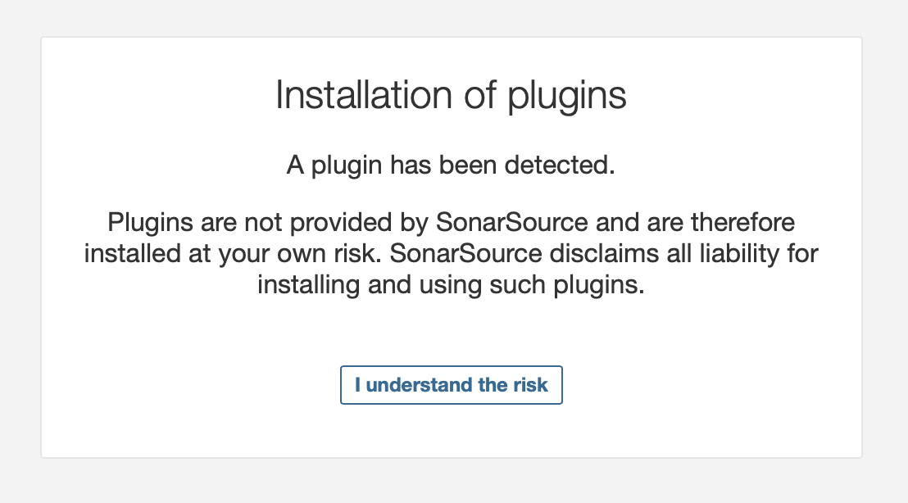

## Configurating a Quality Profile

> [!NOTE]
> If you are already used to SonarQube's Quality Profiles, you can skip this part.
> However, make sure that you are adding the "Cryptography Inventory" rule to the Quality Profile you are using to run the analysis. 

We are going to create a simple [Quality Profile](https://docs.sonarsource.com/sonarqube/latest/instance-administration/quality-profiles/) containing the "Cryptography Inventory" rule of our Cryptography Plugin for testing your configuration. This profile will then be used to run a scan on a sample repo.
If everything is properly configured, it will display cryptography findings in the SonarQube UI and generate a CBOM.

> [!NOTE]
> Alternatively, you can add the rule to an existing Quality Profile of your choice.
> The only exception is that you cannot directly add rules to default Quality Profiles, but if you really want to do this, you can duplicate a default profile to then add the rule to it.

First, click on "Quality Profiles" in the top bar:

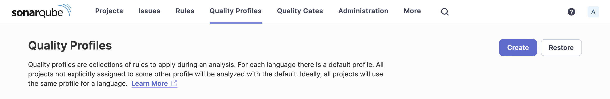

Then, click "Create". In the popup window appearing, check "Create a blank quality profile". In this guide, we are going to test the Java analysis, so select "Java" for language and type "Cryptography" for the name of the profile:

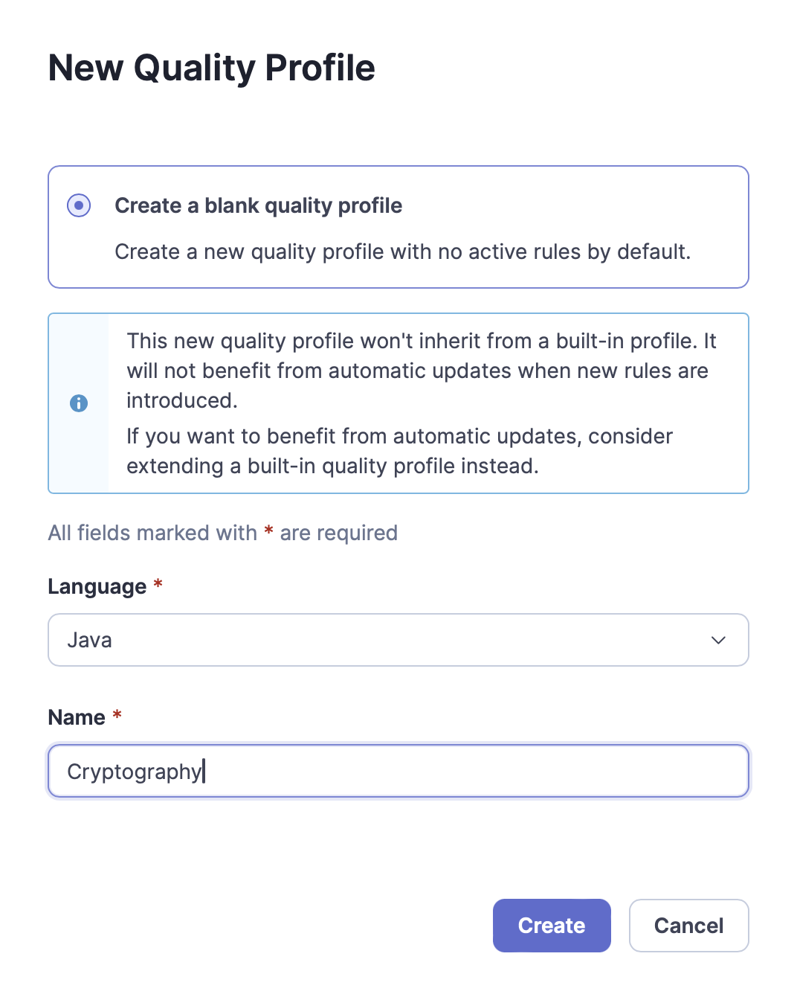

You can now click "Create" to confirm and close the popup.

We now have an empty Quality Profile: let's configure it our "Cryptography Inventory" rule.
To do so, click "Activate More" on the bottom right of the screen:

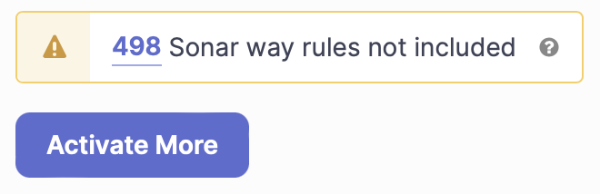

Search for "Cryptography Inventory", and you should see the rule from the Cryptography Plugin which will generate a CBOM:

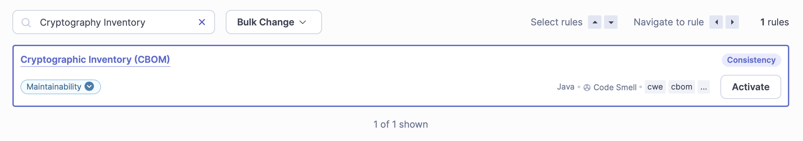


Click "Activate", which will open a popup window:

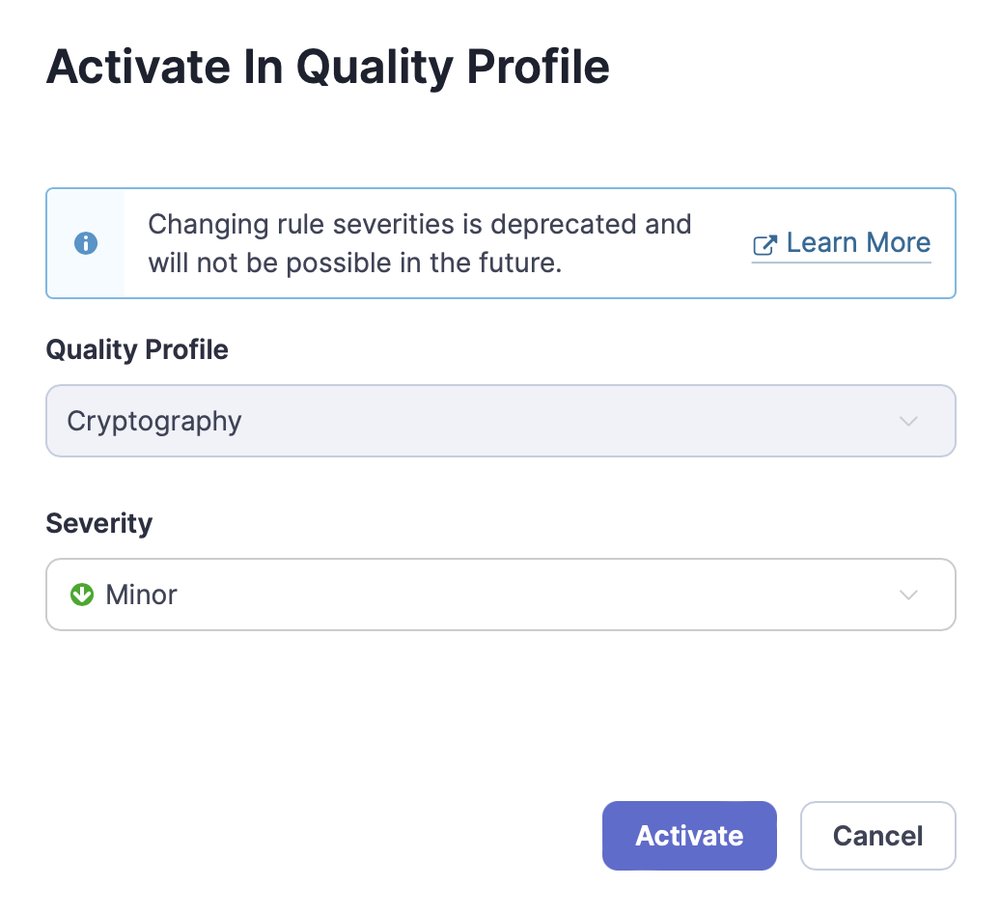

Click on "Activate" again to add this rule to your "Cryptography" Quality Profile.
You now have a correctly configured Quality Profile to use when you want to generate a CBOM.

## Scanning a repo

As a final step, let's test that our plugin correctly reports cryptography findings and generates a CBOM.

To do so, we will test our plugin on the simple repo [`Mastercard/client-encryption-java`](https://github.com/Mastercard/client-encryption-java.git). Start by cloning this repo on the main branch.
To test this repo in the exact same state as we did in this guide, you can `git checkout` on the commit [`50bfc066075d761b7b038c1e27274d8a61cebb74`](https://github.com/Mastercard/client-encryption-java/tree/50bfc066075d761b7b038c1e27274d8a61cebb74).

Now, go back to the SonarQube UI, and click "Projects" on the top bar:

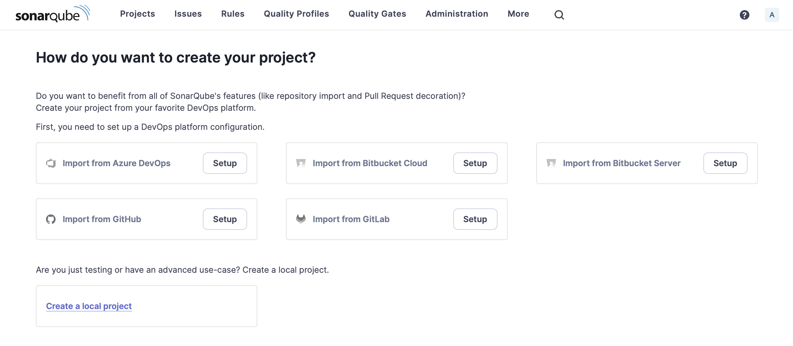

Then, click "Create a local project", then enter "mastercard" for project display name (and key), and leave the branch name on "main":

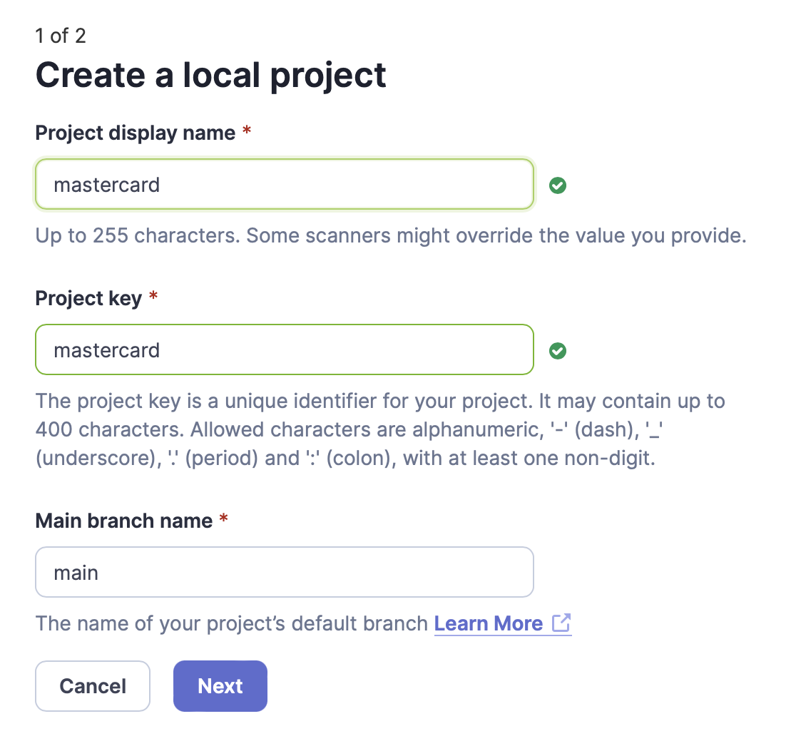

Click "Next", then check "Use the global setting":

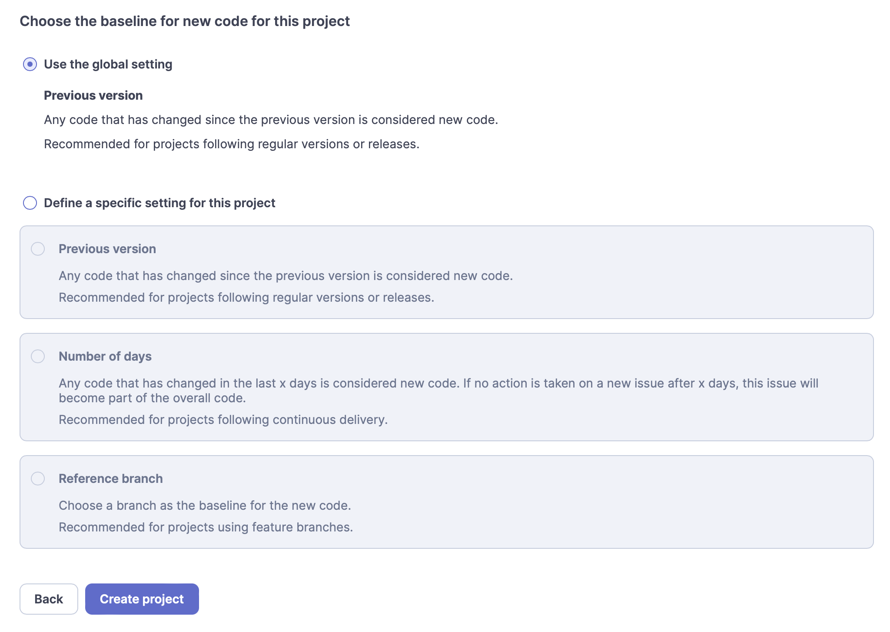

Finally, click "Create project".

Now, let's specify the Quality Profile we want to use for this project.
Click "Project Settings" in the top right to show all the different settings:

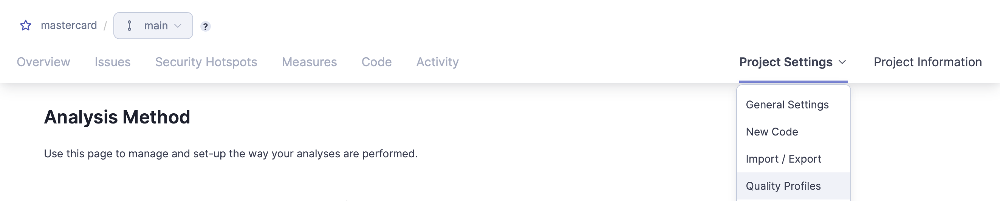

Then click "Quality Profiles":

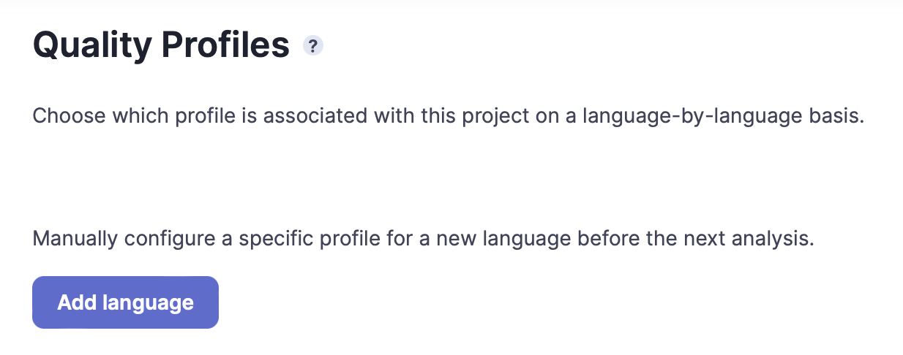

Click "Add language" and it will open a popup window, in which you should pick the "Java" language (in this case) and the "Cryptogaphy" Quality Profile (or whatever other profile you have which contains the "Cryptography Inventory" rule):

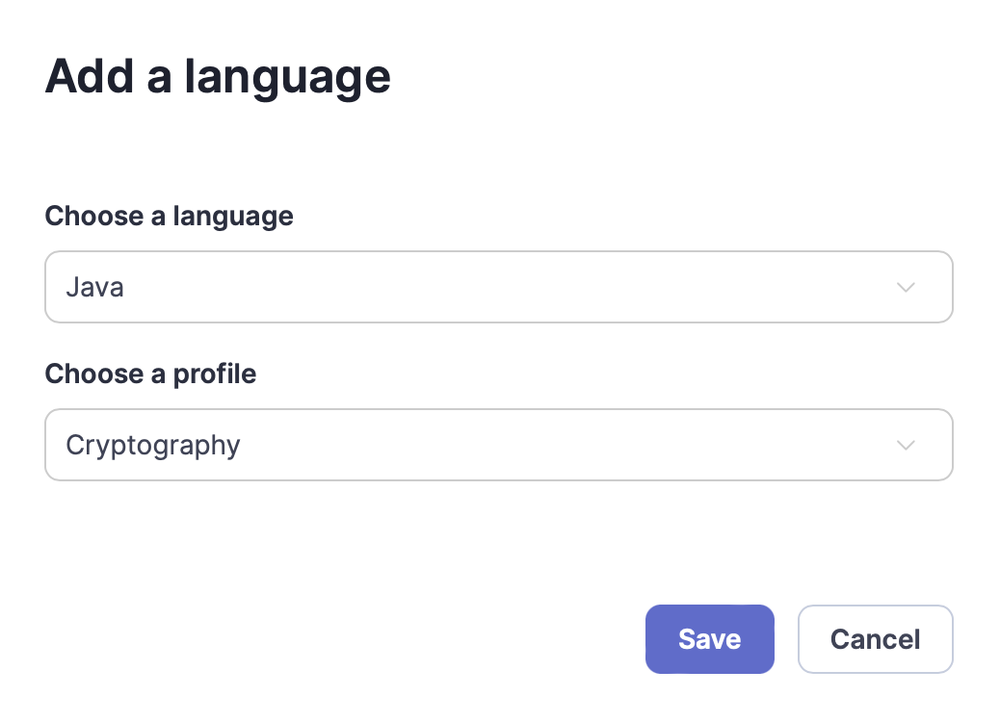

Click "Save", then click on "Overview" in the top left to come back to the main project page.

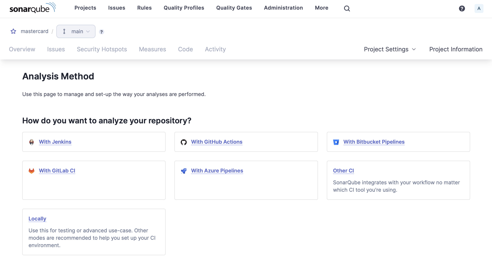.

To start a local scan, click on "Locally". It will prompt you to generate a project token, leave the default values:

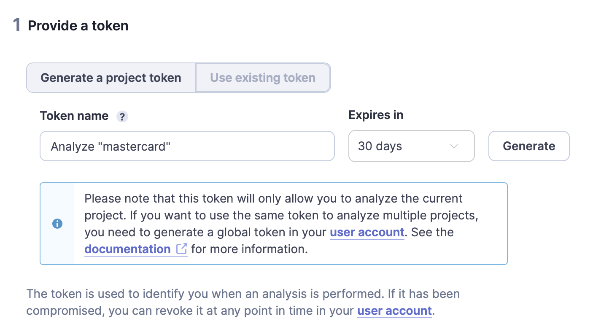

Click "Generate", then "Continue" (you don't have to save the value of your token). Then, click on "Maven", which will open this code snippet:


> [!NOTE]
> At this point, make sure you have [Java](https://www.java.com/en/) and [Maven](https://maven.apache.org) installed.
For reference, at the time of writing this guide, we use Java 17.0.11 and Maven 3.9.7.

Copy this code snippet and open a terminal in the directory of the `client-encryption-java` project you just cloned.
Paste the code snippet in the terminal, but **replace the `verify` argument of the command by `package -DskipTests`** (we don't want to run the tests as they may fail in this case). In our case, the command is now:
```
mvn clean package -DskipTests sonar:sonar \
  -Dsonar.projectKey=mastercard \
  -Dsonar.projectName='mastercard' \
  -Dsonar.host.url=http://localhost:9000 \
  -Dsonar.token=sqp_b5eb445be0c987a7975635bb55f297083f655934
```

If the analysis runs as expected, you should see the results in two ways:
- The "Issues" tab of your project in the SonarQube UI should list all various cryptographic findings: 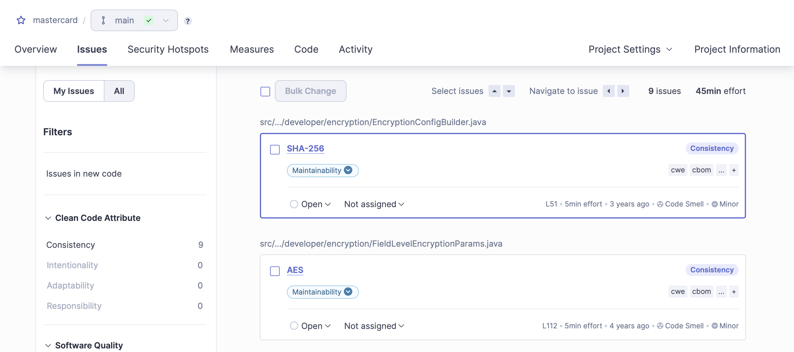
- In the `client-encryption-java` directory, a new file `cbom.json` must have been generated and should contain several components: 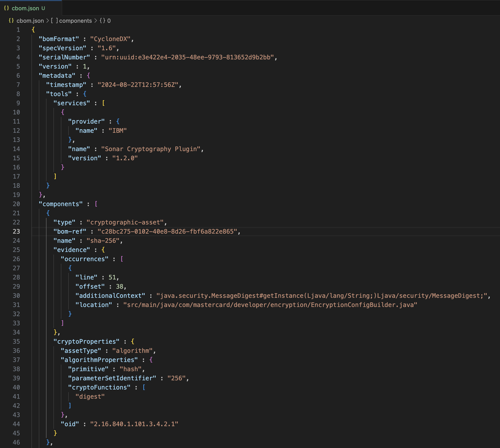

---

If you did not succeed while following all the steps in this guide, please check previous GitHub [issues](https://github.com/IBM/sonar-cryptography/issues?q=is%3Aissue) to check if someone else ever had your problem, otherwise feel free to reach us by creating a new GitHub issue.